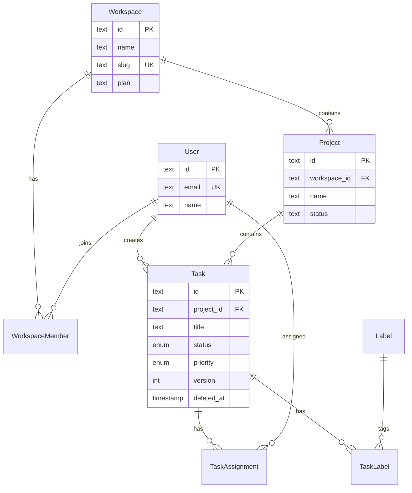

# Index Strategy, Zero-Downtime Migrations & ERD

Read this when choosing indexes, planning a safe migration on a large table, or generating an ERD diagram.

## Index Strategy Decision Framework

```
Query Pattern                          → Index Type
─────────────────────────────────────────────────────
WHERE col = value                      → B-tree (default)
WHERE col1 = v1 AND col2 = v2         → Composite B-tree (col1, col2)
WHERE col = value AND deleted_at IS NULL → Partial index with WHERE clause
WHERE col IN (v1, v2, v3)             → B-tree (handles IN efficiently)
WHERE col LIKE 'prefix%'              → B-tree (prefix match only)
WHERE col LIKE '%substring%'          → GIN with pg_trgm extension
WHERE jsonb_col @> '{"key": "val"}'   → GIN on JSONB column
WHERE to_tsvector(col) @@ query       → GIN on tsvector
ORDER BY col DESC LIMIT N             → B-tree DESC
SELECT a, b WHERE a = v               → Covering index INCLUDE(b)
```

### Index Anti-Patterns

| Anti-Pattern | Why It Hurts | Fix |
|-------------|-------------|-----|
| Index on every column | Write overhead, storage bloat | Index only queried columns |
| No index on foreign keys | Slow JOINs and CASCADE deletes | Always index FK columns |
| Missing partial index for soft deletes | Full table scan on `WHERE deleted_at IS NULL` | Add `WHERE deleted_at IS NULL` to index |
| Composite index in wrong order | Index unused for prefix queries | Put most selective / equality column first |
| No index maintenance | Bloated indexes, slow queries | Schedule REINDEX CONCURRENTLY |

## Zero-Downtime Migration Patterns

### Adding a NOT NULL Column to a Large Table

```sql
-- WRONG: locks table for duration of ALTER
ALTER TABLE tasks ADD COLUMN assignee_id TEXT NOT NULL;

-- RIGHT: three-phase migration
-- Phase 1: Add nullable column (instant, no lock)
ALTER TABLE tasks ADD COLUMN assignee_id TEXT;

-- Phase 2: Backfill in batches (no lock)
UPDATE tasks SET assignee_id = created_by_id
WHERE assignee_id IS NULL AND id > $last_processed_id
LIMIT 10000;
-- Repeat until all rows backfilled

-- Phase 3: Add NOT NULL constraint (brief lock, but validates existing data)
ALTER TABLE tasks ALTER COLUMN assignee_id SET NOT NULL;
```

### Renaming a Column Safely

```sql
-- WRONG: ALTER TABLE RENAME COLUMN breaks all running code instantly

-- RIGHT: expand-contract pattern
-- Phase 1: Add new column, write to both
ALTER TABLE tasks ADD COLUMN assignee_user_id TEXT;
-- Deploy code that writes to BOTH old_name and new_name

-- Phase 2: Backfill
UPDATE tasks SET assignee_user_id = old_assignee WHERE assignee_user_id IS NULL;

-- Phase 3: Switch reads to new column
-- Deploy code that reads from new_name only

-- Phase 4: Drop old column (after all deployments use new name)
ALTER TABLE tasks DROP COLUMN old_assignee;
```

## ERD Generation (Mermaid)


