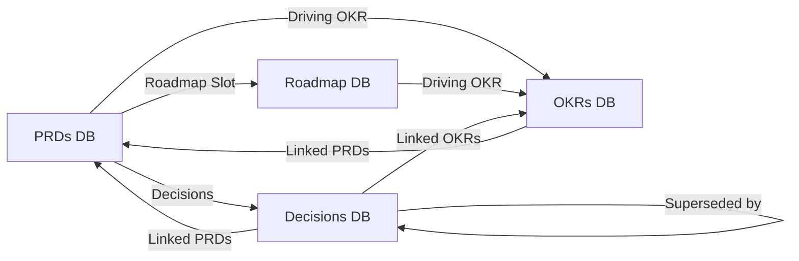

# Example: Building a Product Team's Notion Workspace from Scratch

> Real-world scenario showing how to apply this skill end-to-end.

## Context

Helix Platform (devtools, Series A, 30 people) hired its first Head of Product (Devraj). The product org is three PMs, two designers, and the founding CEO who used to "be product." Documents are scattered: PRDs in Google Docs, OKRs in a shared spreadsheet, the roadmap in Figma slides, and tech decisions in a Slack channel called #adr-maybe.

Devraj is consolidating everything into Notion. The workspace must support four core PM artifacts (PRDs, OKRs, Roadmap, Decisions) as connected databases with cross-links, not as 200 isolated pages. The goal is one URL per artifact, with relations that let anyone navigate from a roadmap item to its PRD to its OKR.

## Inputs

- 30 people, ~12 active "product-adjacent" contributors
- Existing artifacts to migrate: ~35 PRDs, 16 OKRs (current + last 2 quarters), one roadmap, ~80 historical decisions
- Constraint: every database needs at least three views (table, board, timeline as applicable)
- Templates must be enforceable: every new PRD starts from the template, not from scratch
- Audience: the product team for daily use; engineers and execs for read

## Applying the skill

1. **Design the four databases** first with their properties + relations *before* importing any content.
2. **Build the page templates** (PRD, OKR, Decision) so every entry has the same shape.
3. **Create the views** PMs actually use: by-status, by-quarter, by-owner.
4. **Wire the relations** so a PRD links to its driving OKR and its roadmap slot.
5. **Migrate existing artifacts** with the API, not by hand.
6. **Document a Notion playbook** so the team knows the contract.

## The artifact

### Database 1: PRDs

**Schema:**

| Property | Type | Notes |
|----------|------|-------|
| Title | Title | "PRD: <feature>" |
| Status | Select | Draft / In Review / Approved / Building / Shipped / Killed |
| Author | Person | One required |
| Reviewers | Person (multi) | At least 1 eng + 1 design |
| Driving OKR | Relation -> OKRs DB | Which OKR this serves |
| Roadmap Slot | Relation -> Roadmap DB | Where it lives in Now/Next/Later |
| Decisions | Relation -> Decisions DB | DACI decisions tied to this PRD |
| Target Ship Date | Date | -- |
| Approved Date | Date | Filled when status -> Approved |
| RICE Score | Number | -- |

**Views (5):**

- **My PRDs** (filter: Author = Me, sort by Status)
- **In Review** (filter: Status = In Review, sort by Date created)
- **By Status** (board view, group by Status)
- **Shipped this quarter** (filter: Status = Shipped AND Approved Date in current quarter)
- **At risk** (filter: Status = Building AND Target Ship Date in past)

**Page template (PRD):**

Headings prefilled, ~10 sections aligned with the create-prd skill:
1. TL;DR (3 lines)
2. Problem statement
3. Goal + non-goal
4. User stories (linked to WWAS template if needed)
5. Solution overview
6. Detailed design (or link to Figma)
7. Metrics / OKR alignment (auto-pull from Driving OKR relation)
8. Risks + open questions
9. Timeline + milestones
10. Approvals (callout block with @-mentions)

### Database 2: OKRs

**Schema:**

| Property | Type | Notes |
|----------|------|-------|
| Title | Title | Objective text |
| Type | Select | Objective / Key Result |
| Parent Objective | Relation -> OKRs DB (self) | Only for KRs |
| Quarter | Select | Q1-2026, Q2-2026, ... |
| Owner | Person | -- |
| Status | Select | On track / At risk / Off track / Achieved / Missed |
| Target | Text | "Activation rate from 18% to 28%" |
| Current | Text | Updated weekly |
| Confidence | Number 0-1 | 0.6 by default; updated weekly |
| Linked PRDs | Relation -> PRDs DB | PRDs that move this OKR |
| Linked Decisions | Relation -> Decisions DB | Strategic decisions affecting this OKR |

**Views (4):**

- **Current quarter** (filter: Quarter = current)
- **My OKRs** (filter: Owner = Me)
- **At risk / Off track** (filter: Status in [At risk, Off track])
- **Hierarchy** (table grouped by Parent Objective)

**Page template (OKR):**
- The KR statement
- "Why this matters" (1 paragraph)
- Linked PRDs (synced from relation)
- Weekly check-in log (callout-block table: date / confidence / commentary)
- Risks
- What changes if this slips

### Database 3: Roadmap

**Schema:**

| Property | Type | Notes |
|----------|------|-------|
| Title | Title | Initiative name |
| Horizon | Select | Now / Next / Later / Parked |
| Theme | Multi-select | Activation / Enterprise / Platform / Compliance |
| Owner | Person | Single PM |
| Target Quarter | Select | Q1-2026 ... Q4-2027 |
| Status | Select | Discovery / In Design / Building / Shipped / Killed |
| RICE Score | Number | Pulled in from prioritization tool |
| Driving OKR | Relation -> OKRs DB | -- |
| PRDs | Relation -> PRDs DB | -- |
| Stakeholders | Person (multi) | -- |

**Views (5):**

- **Now / Next / Later** (board view, group by Horizon)
- **Timeline** (timeline view by Target Quarter)
- **By Theme** (board, group by Theme)
- **At risk** (filter: Status != Shipped AND Target Quarter past)
- **Killed** (filter: Status = Killed; archive view for learning)

### Database 4: Decisions

**Schema:**

| Property | Type | Notes |
|----------|------|-------|
| Title | Title | "Decision: <topic>" |
| Status | Select | Proposed / Accepted / Rejected / Superseded |
| Date Decided | Date | -- |
| Driver (DACI) | Person | Who facilitated |
| Approver (DACI) | Person | Who said yes/no |
| Contributors (DACI) | Person (multi) | -- |
| Informed (DACI) | Person (multi) | -- |
| Reversibility | Select | One-way / Reversible / Easily reversible |
| Linked PRDs | Relation -> PRDs DB | -- |
| Linked OKRs | Relation -> OKRs DB | -- |
| Superseded by | Relation -> Decisions DB (self) | -- |

**Views (4):**

- **Recent** (sort by Date Decided desc, last 90 days)
- **By Status**
- **One-way decisions** (filter: Reversibility = One-way) -- "the big ones"
- **By area** (group by Linked PRDs)

**Page template (Decision):**
- Context (3-5 sentences)
- Options considered (with bullets)
- Decision
- Rationale
- Consequences (3+ bullets)
- Decision date
- Revisit by (optional date)

### Relations diagram



### Migration script (Notion REST API)

```python
import requests, json

NOTION_TOKEN = "secret_..."
HEADERS = {
    "Authorization": f"Bearer {NOTION_TOKEN}",
    "Notion-Version": "2022-06-28",
    "Content-Type": "application/json",
}

DB_IDS = {
    "PRDs": "db-id-prds",
    "OKRs": "db-id-okrs",
    "Roadmap": "db-id-roadmap",
    "Decisions": "db-id-decisions",
}

def create_prd_page(prd_dict):
    payload = {
        "parent": {"database_id": DB_IDS["PRDs"]},
        "properties": {
            "Title": {"title": [{"text": {"content": prd_dict["title"]}}]},
            "Status": {"select": {"name": prd_dict.get("status", "Draft")}},
            "Author": {"people": [{"id": prd_dict["author_id"]}]},
            "Target Ship Date": {"date": {"start": prd_dict["target_date"]}},
            "RICE Score": {"number": prd_dict.get("rice", 0)},
        },
        "children": prd_dict["blocks"],  # markdown -> Notion blocks
    }
    r = requests.post("https://api.notion.com/v1/pages", headers=HEADERS, data=json.dumps(payload))
    r.raise_for_status()
    return r.json()["id"]

# Migrate each Google Doc PRD using prd_scaffolder.py output format
for prd in EXISTING_PRDS:
    blocks = render_markdown_as_notion_blocks(prd["markdown"])
    create_prd_page({
        "title": prd["title"], "status": prd["status"],
        "author_id": LOOKUP_USER[prd["author"]],
        "target_date": prd["target"], "rice": prd["rice"], "blocks": blocks,
    })
```

After migration: link PRDs to OKRs to Roadmap via the relation API:

```python
def link_prd_to_okr(prd_id, okr_id):
    requests.patch(f"https://api.notion.com/v1/pages/{prd_id}", headers=HEADERS, data=json.dumps({
        "properties": {"Driving OKR": {"relation": [{"id": okr_id}]}}
    }))
```

### Notion playbook page (workspace home)

A single page titled "How we use Notion at Helix" with:

1. The four databases and what each is for
2. The decision: "if it's a PRD, OKR, roadmap slot, or decision -- it lives in the DB. Period."
3. The naming conventions
4. The relation rules ("every PRD must link to a Driving OKR before status = Approved")
5. The "kill the doc" guidance (do not create ad-hoc top-level docs for these artifacts)
6. Cadence (weekly OKR check-in update, monthly roadmap review)
7. The link to the latest cross-tool sync (Linear -> Notion roadmap mirror)

### Three months later: usage snapshot

| Metric | Before Notion | After 90 days |
|--------|---------------|---------------|
| Time to find latest PRD | ~7 min | <30 sec |
| OKR check-ins per quarter | 4 | 13 (one weekly per active KR) |
| Decisions with named DACI roles | 30% | 92% |
| Cross-tool drift (Notion vs Slack vs Docs) | Constant | Detected by weekly diff job |

## Why this works

- Four databases + relations replaces ~600 ad-hoc pages and ten spreadsheets.
- Page templates make every PRD start the same way -- a forcing function for quality.
- Relations let anyone walk the graph: roadmap -> PRD -> OKR -> decisions affecting it.
- Migration via the Notion API preserves history and saves ~80 hours of copy-paste work.
- The "Notion playbook" page is the contract. Drift gets caught at weekly OKR check-in.
- Killed-roadmap-items view is a learning artifact, not a graveyard. The team can scan it before kickoff to avoid repeating bad bets.

## What's next

- Mirror Linear cycles into the Roadmap DB via `../linear-expert/` GraphQL pulls.
- Auto-populate OKR check-ins via `../execution/status-update-generator/` outputs.
- Push PRD template enforcement into the team's PR review process via `../execution/create-prd/`.
- For PM career growth artifacts, use `../career/pm-career-ladder/` separately (do not mix with these four DBs).
