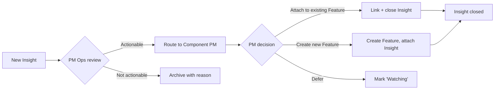

# Example: Setting Up Productboard for a 4-Team Product Org

> Real-world scenario showing how to apply this skill end-to-end.

## Context

Wayfinder (travel-tech, Series B, 120 people) has four product teams: Bookings, Mobile, Field Operations, and Platform. Customer feedback was leaking into a dozen channels -- support tickets in Zendesk, sales notes in Salesforce, Slack DMs to PMs, scattered Intercom chats, and the occasional Twitter thread. Three of four PMs reported the same complaint at their last 1:1: "I cannot tell which signals to trust."

The Head of Product (Liana) chose Productboard to fix the signal-to-feature pipeline. Goal: every actionable piece of customer evidence enters Productboard's Insight inbox, is triaged in 48 hours, attached to a Feature in the right component, scored against agreed Drivers, and lands in a Release that pushes to Jira automatically.

## Inputs

- Four product teams; 1 PM each + 1 shared PM Ops person
- Existing customer-feedback sources: Zendesk, Salesforce, Intercom, Slack, Twitter, customer interview notes
- Engineering tracker: Jira (existing setup)
- Roadmap audience: exec board + customers (via public Roadmap)
- Constraint: PMs should not spend more than 2 hours/week on Insight triage

## Applying the skill

1. **Set the Component hierarchy** before anything else -- the structure under which all Features live.
2. **Wire the Insight intake sources** (Zendesk, Salesforce, Intercom, Slack, email) with auto-routing.
3. **Define the Drivers** (weighted prioritization criteria) the team will score every Feature against.
4. **Create the triage workflow** with explicit roles and SLAs.
5. **Set up the Releases hierarchy** and the Jira integration.
6. **Build the Roadmap views** for execs, customers, and engineering.

## The artifact

### Component hierarchy

```
Wayfinder Product
|-- Bookings
|   |-- Reservations
|   |-- Payments
|   |-- Cancellations & Refunds
|   |-- Multi-leg Itineraries
|-- Mobile (Field Guide App)
|   |-- Onboarding & Sign-in
|   |-- Tour Day Workflow
|   |-- Offline Sync
|-- Field Operations
|   |-- Tour Manifest
|   |-- Guest Communications
|   |-- Issue Reporting
|-- Platform
|   |-- API & Webhooks
|   |-- Authentication & SSO
|   |-- Observability & Audit
```

Each Component has a single PM owner. Features within roll up to that PM's queue.

### Insight intake sources + routing

| Source | Method | Routing rule |
|--------|--------|--------------|
| Zendesk tickets | Native integration; auto-pull every 10 min | Tag `pb-bookings`/`pb-mobile`/`pb-platform` -> component owner |
| Salesforce opportunities | Native integration; sales-notes field synced | If account ARR >$100K, mark "Customer: enterprise" |
| Intercom chats | Native integration | Manual save-as-Insight from Intercom UI |
| Slack #voice-of-customer | Slack-to-Productboard bot | Posts in channel become Insights; PM Ops triages |
| Customer interviews | Manual via Chrome extension | PM tags interviewee + recurring theme |
| Sales emails | Forward to `pb@wayfinder.productboard.com` | Auto-categorized by keyword + sender domain |

### Insight triage workflow (the 48-hour SLA)



**Roles:**
- **PM Ops (Sasha):** triage every Insight within 24 hours; route to component PM or archive
- **Component PM:** decide within 48 hours -- attach, create, or defer
- **Watcher status:** auto-bump every 30 days; if defers > 3, force a decision

### Drivers (weighted prioritization criteria)

The team agreed on five Drivers, totaling 100%:

| Driver | Weight | Description | Scoring |
|--------|--------|-------------|---------|
| Customer Reach | 25% | How many customers are asking, weighted by ARR | 1=<5 customers, 5=>50 enterprise customers |
| Revenue Impact | 25% | Expansion / retention / new-deal influence | 1=indirect, 5=named in pipeline |
| Strategic Fit | 20% | Aligns with H2 themes (multi-leg, offline, audit) | 1=tangential, 5=core to a theme |
| Effort (inverse) | 15% | Engineering cost, scored low-effort = high score | 1=>6 mo, 5=<1 mo |
| Confidence | 15% | How sure we are about Impact + Effort | 1=guess, 5=validated by data |

The Productboard Feature Score formula:

```
Feature Score = (Reach * 0.25) + (Revenue * 0.25) + (Strategy * 0.20)
              + (Effort * 0.15) + (Confidence * 0.15)
```

### Releases hierarchy

```
2026 H2 Plan (Release Group)
|-- Q3 2026 Release (Sep cutover)
|   |-- Multi-leg Itineraries v1
|   |-- Mobile Offline Sync v2
|   |-- Audit Log Search MVP
|-- Q4 2026 Release (Dec cutover)
|   |-- Multi-leg Itineraries v1.1
|   |-- Webhook Signing
|   |-- SSO via WorkOS

2027 H1 Plan (Release Group)
|-- Q1 2027 Release
|   |-- TBD (planning Jan 2027)
```

A Feature can be in only one Release at a time. Features without a Release are in the "Discovery" or "Watching" status.

### Jira integration

```yaml
integration:
  type: jira-cloud
  url: https://wayfinder.atlassian.net
  push_direction: productboard -> jira
  sync:
    Feature -> Epic
    when: Feature added to a Release
    fields:
      summary: Feature.name
      description: Feature.description
      epic_name: Feature.name
      labels: [productboard, <component-name>]
      custom_fields:
        productboard_id: Feature.id
        productboard_score: Feature.score
        target_release: Feature.release.name
  pull_direction: jira -> productboard
  fields:
    Feature.status: jira_epic.status (mapped)
    Feature.completion_pct: rollup from jira_epic children
```

### Roadmap views (the three audiences)

#### Exec board view

- **Group by:** Theme (multi-leg, offline, audit, enterprise, platform)
- **Timeline:** Now / Next / Later (no specific dates exposed)
- **Filters:** Only features in a current or upcoming Release
- **Sort:** Feature Score desc

#### Customer-facing public roadmap

- **Group by:** Component (Bookings, Mobile, Field Ops, Platform)
- **Status labels:** Considering / Planned / In Development / Released
- **Filter:** customer-safe items only (manual flag per Feature)
- **No effort or revenue data exposed**
- **Each card has:** title, short description, "upvote" button + count

#### Engineering view

- **Group by:** Squad (mapped from Component owner)
- **Timeline:** Per Release with dates
- **Includes:** linked Jira epic, current sprint position, dependencies
- **Filter:** in-flight items only

### Productboard REST API patterns

#### Pull all open Insights tagged for Bookings

```python
import requests

PB_API = "https://api.productboard.com"
HEADERS = {
    "Authorization": f"Bearer {PB_TOKEN}",
    "X-Version": "1",
    "Content-Type": "application/json",
}

def list_insights(component_id):
    params = {"componentId": component_id, "status": "open"}
    res = requests.get(f"{PB_API}/notes", headers=HEADERS, params=params)
    return res.json()["data"]
```

#### Create a Feature programmatically (when migrating from a spreadsheet)

```python
def create_feature(name, description, component_id):
    body = {
        "data": {
            "name": name,
            "description": description,
            "componentId": component_id,
            "status": {"name": "candidate"},
        }
    }
    res = requests.post(f"{PB_API}/features", headers=HEADERS, json=body)
    return res.json()["data"]
```

#### Push a feature into a Release

```python
def add_to_release(feature_id, release_id):
    body = {"data": {"releaseId": release_id}}
    res = requests.patch(f"{PB_API}/features/{feature_id}", headers=HEADERS, json=body)
    return res.json()
```

#### Driver-scoring update (weekly sync from analytics)

```python
def update_driver_score(feature_id, driver_id, score, comment):
    body = {"data": {"value": score, "note": comment}}
    requests.patch(
        f"{PB_API}/features/{feature_id}/drivers/{driver_id}",
        headers=HEADERS, json=body,
    )
```

### Weekly cadence

| Day | Activity | Owner | Duration |
|-----|----------|-------|----------|
| Monday 09:00 | PM Ops sweeps inbox; routes all Insights | Sasha | 45 min |
| Monday 14:00 | Component PMs review their queue | 4 PMs | 30 min each |
| Wednesday 11:00 | Weekly Driver re-scoring sync (new evidence -> updated scores) | All PMs | 30 min |
| Friday 15:00 | Roadmap review + sync to Jira | Liana + PM Ops | 60 min |

### Three-month outcomes

| Metric | Before Productboard | After 90 days |
|--------|---------------------|---------------|
| Time from customer signal to Feature attachment | 2-3 weeks | <48 hours (SLA met for 91% of insights) |
| Features with >=3 Insights attached | 22% | 78% |
| PM time on triage | ~5 hours/week | 1.8 hours/week (under target) |
| Customer-roadmap engagement | n/a | 412 upvotes; 24 customer comments |
| Sales-to-PM "where's the feature?" Slack DMs | ~30/week | ~4/week |

## Why this works

- The Component hierarchy is set before anything else. Insights and Features need a place to land.
- Insight intake covers all five real signal sources. The team did not pick three and pretend Slack does not exist.
- Drivers are agreed upfront with explicit weights. Re-scoring happens weekly, not just at quarterly planning.
- Releases are time-boxed and pushed automatically to Jira -- the engineering tracker reflects Productboard, not the other way around.
- Three Roadmap views = three audiences. The public-customer view does not leak effort or revenue.
- A 48-hour SLA on triage with a named owner stops the inbox from rotting.

## What's next

- Mirror selected Releases into Notion via `../notion-pm/` for the Roadmap DB.
- For Jira details on the engineering side, use `../jira-expert/`.
- Use `../execution/customer-feedback-triage/` for the upstream methodology behind Insight triage.
- Cross-reference the Driver scoring against `../execution/prioritization-frameworks/` Weighted Decision Matrix.
- Re-tune Driver weights quarterly using `../execution/quarterly-planning/`.
