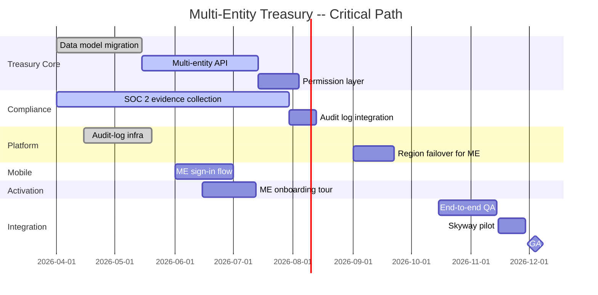

# Example: Multi-Project Portfolio Review for a GA Launch

> Real-world scenario showing how to apply this skill end-to-end.

## Context

Northwind SaaS (fintech, Series C, 200 people) is coordinating five teams toward a single GA launch of "Multi-Entity Treasury" on 2026-12-04 -- a contracted commit to flagship customer Skyway Logistics. The Program Manager (Petra) was hired six months ago specifically to run cross-team programs after Northwind's Q3 GA missed by 5 weeks because three dependencies were caught too late.

The five contributing teams are: Treasury Core, Compliance, Platform, Mobile, and Activation. Each has its own squad lead, sprint cadence, and tracker. Petra runs a portfolio review every two weeks plus a steering committee monthly. This artifact is the bi-weekly review for May 22, 2026 -- T-minus 27 weeks to GA.

## Inputs

- 5 teams, 5 squad leads, 1 sponsor (CTO Hari)
- 1 GA deadline: 2026-12-04 (contracted with Skyway)
- 47 work items across 5 teams, 18 of which have cross-team dependencies
- Risk register: 9 active risks; 2 escalated to steering
- Budget: not a constraint (capacity is)

## Applying the skill

1. **Aggregate status across all 5 teams** in one view (R/Y/G + headline).
2. **Map dependencies and compute the critical path.**
3. **Triage risks by Likelihood x Impact** (Expected Monetary Value where applicable).
4. **Prepare escalations** with named owners and decisions needed.
5. **Issue a single program-status artifact** to the steering committee and the five teams.

## The artifact

---

# Multi-Entity Treasury: Program Status -- 2026-05-22

**Program manager:** Petra Sandoval
**Sponsor:** Hari Mukherjee (CTO)
**GA target:** 2026-12-04 (T-27 weeks)
**Overall status:** YELLOW
**Status rationale:** Critical path is intact but two cross-team dependencies are aging into risk; compliance audit evidence collection is behind plan.

## Team-level status snapshot

| Team | Status | Confidence | Lead | Headline |
|------|--------|-----------|------|----------|
| Treasury Core | Yellow | 0.7 | Tomas Veliz | FX edge cases discovered; 2 weeks behind on Multi-Entity API |
| Compliance | Yellow | 0.65 | Hari Patel | SOC 2 Type II evidence at 65% (plan was 75% by today) |
| Platform | Green | 0.85 | Marcus Vella | Audit-log infra on schedule; ready for Compliance to use |
| Mobile | Green | 0.9 | Jin Lee | Multi-entity sign-in flow in design review; no concerns |
| Activation | Green | 0.85 | Ramon Cortes | Multi-entity onboarding tour spec done; build starts next week |

## Critical path

**Critical path runs:** Data model migration -> Multi-entity API -> Permission layer -> E2E QA -> Skyway pilot -> GA.

**Current slack on critical path:** 3 weeks (was 5 weeks before the FX edge-case discovery).

## Cross-team dependencies (the 18)

| # | From | To | What | Status | Due | At risk? |
|---|------|-----|------|--------|-----|----------|
| 1 | Platform | Treasury Core | Audit-log API ready | Done | -- | No |
| 2 | Platform | Compliance | Audit-log tamper evidence | In progress | 2026-06-15 | No |
| 3 | Treasury Core | Mobile | ME API contract finalized | Slipping | 2026-06-01 | YES (1 week late) |
| 4 | Treasury Core | Activation | ME entity-creation API | Slipping | 2026-06-15 | YES (1 week late) |
| 5 | Compliance | Treasury Core | Audit field requirements doc | Pending | 2026-05-29 | At risk |
| 6 | Mobile | Treasury Core | Permission token format | Done | -- | No |
| 7-18 | (various lower-priority) | | | Mostly on track | | |

**Top concern:** Dependencies 3 and 4 are slipping. Mobile and Activation cannot start their cross-entity work until Treasury Core's API contract is final. If it slips two more weeks, both teams lose July build time.

## Risk register (active)

| # | Risk | L | I | EMV* | Mitigation | Owner | Due | Status |
|---|------|---|---|------|-----------|-------|-----|--------|
| R1 | Treasury Core API delay cascades to Mobile + Activation | H | H | $480K | Daily standup, scope freeze on API, contractor for ramp | Tomas Veliz | 2026-06-01 | Escalating |
| R2 | SOC 2 evidence behind plan -> Skyway pilot can't sign | M | H | $240K | Compliance daily standup, weekly Infra coord call | Hari Patel | 2026-07-15 | Active |
| R3 | Skyway requirements change after pilot start | M | H | $300K | Weekly Skyway sync, written change-control | Mira Chen (VP Sales) | Ongoing | Mitigated |
| R4 | Multi-entity FX rate provider has rate limits | M | M | $40K | Engage provider for higher tier | Tomas Veliz | 2026-06-15 | Active |
| R5 | Activation rate could miss OKR if ME onboarding flow is unfamiliar | M | M | -- | A/B test ME flow vs single-entity | Ramon Cortes | 2026-08-15 | Active |
| R6 | Designers shared with another program | L | M | -- | Lock designer time in PM | Ines Petrov | 2026-06-01 | Mitigated |
| R7 | Skyway expects features not in scope | M | M | $120K | Written scope doc countersigned | Mira + Hari M. | 2026-06-15 | Active |
| R8 | Mobile App-Store approval slips | L | H | $360K | Submit 3 weeks early | Jin Lee | 2026-11-01 | Watch |
| R9 | Annual security audit overlaps Compliance team Q4 | M | M | -- | Push security audit to Q1 2027 if possible | Hari Patel | 2026-06-15 | Active |

*EMV (Expected Monetary Value) is Likelihood-weighted impact in ARR-equivalent terms.

## Decisions needed from steering committee

### Decision 1: Bring in a contractor for Treasury Core?

**Context:** R1 is the single biggest risk to GA. Tomas estimates a 4-week contractor on ME API work would buy back 2 weeks of slack.
**Cost:** $42K for an 8-week contractor engagement
**Recommendation:** Approve. EMV reduction far exceeds the cost.
**Required by:** 2026-05-29

### Decision 2: Freeze ME API scope on 2026-06-01?

**Context:** Mobile and Activation are blocked until the API contract is final. Tomas wants to keep iterating; the dependency teams need a final.
**Recommendation:** Freeze on 2026-06-01. Any post-freeze change requires PM-level approval.
**Required by:** 2026-05-29

### Decision 3: Skyway pilot start -- hold or slip?

**Context:** Pilot was Nov 1 start. SOC 2 evidence pace makes Nov 1 marginal.
**Recommendation:** Hold Nov 1 with a Yellow flag. Decide at 2026-09 steering whether to slip 2 weeks.
**Required by:** 2026-09 steering

## Status by deliverable

### Multi-Entity API (Treasury Core)

- Scope: 12 endpoints + permission layer + audit hooks
- Completion: 65% (was 80% projected by today)
- Blocking: dependencies 3 and 4
- Mitigation: contractor (Decision 1), scope freeze (Decision 2)

### SOC 2 Type II Evidence Collection (Compliance)

- Scope: 87 control evidence items
- Completion: 65% (was 75% projected)
- Blocking: Infra team availability (R9)
- Mitigation: daily standup; if not >=80% by 2026-06-15, escalate to CTO

### Audit Log Infrastructure (Platform)

- Scope: tamper-evident append-only log + query API
- Completion: 100%
- Blocking: none
- Status: handed to Compliance for SOC 2 use

### Multi-Entity Mobile Sign-In (Mobile)

- Scope: switch entity from sign-in screen
- Completion: 40% (in design)
- Blocking: dependency 3 (API contract)
- Status: design proceeding on placeholder contract; rework risk Y if dep 3 changes shape

### Multi-Entity Onboarding Tour (Activation)

- Scope: in-app tour for users switching contexts
- Completion: 10% (spec done; build pending)
- Blocking: dependency 4 (entity-creation API)
- Status: build can start with placeholder API; rework risk same as Mobile

## Resource allocation snapshot

| Team | Engineers on this program | Engineers on other work | Risk |
|------|---------------------------|-------------------------|------|
| Treasury Core | 8 | 6 | Will pull 2 more from other work if R1 worsens |
| Compliance | 7 | 2 | Stable |
| Platform | 4 | 14 | Stable; 1 engineer rotates back after audit-log handoff |
| Mobile | 5 | 0 | Stable |
| Activation | 4 | 8 | Stable; can pull 1 more if needed |

## What changed since last review (2026-05-08)

- Treasury Core slipped from Green to Yellow (FX edge cases)
- Compliance moved from Green to Yellow (SOC 2 pace)
- Platform completed audit-log infra (on schedule)
- Two new risks added (R4 FX provider, R7 Skyway scope expansion)
- Dependency 3 + 4 moved to "Slipping" status

## What I will report to the steering committee (Jun 5)

- Overall Yellow with named mitigations
- Three decisions needed (contractor, scope freeze, Skyway hold/slip)
- R1 is the dominant risk; everything else is manageable
- Critical-path slack remains at 3 weeks if Decisions 1 + 2 land

## Why this works

- One snapshot covers five teams. The steering committee does not have to read five separate updates.
- Critical path is named and visualized. The 3-week slack number is the most-watched metric.
- Cross-team dependencies are listed with status, due dates, and at-risk flags. Slipping dependencies are surfaced before they cascade.
- Risks use Likelihood x Impact + EMV in dollar terms. Steering can compare risks against the contractor cost (Decision 1).
- Decisions needed are written with context + recommendation + required-by date. Steering can decide in the meeting instead of taking it offline.
- Resource allocation includes "engineers on other work" so the steering committee understands the slack each team has.

## What's next

- Issue this artifact to the steering committee and five team leads (2026-05-23).
- Schedule a 30-minute decision-only steering session on 2026-05-29 for Decisions 1 + 2.
- Update the dependency tracker via `../execution/dependency-map/` after each team standup.
- Roll team-level risks into the portfolio register via `../senior-pm/`.
- Use `../execution/status-update-generator/` to feed individual team weekly updates into this program-level view.
- Re-run this artifact every two weeks; archive prior versions for trend visibility.
