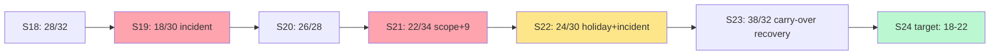

# Example: Sprint Health Analysis for a 7-Person Team

> Real-world scenario showing how to apply this skill end-to-end.

## Context

Acme Analytics' Search Platform team (B2B analytics SaaS, Series B, 80 people) has 7 engineers + 1 designer + 1 PM. The Scrum Master (Mira) has been with the team for 9 sprints. Velocity is volatile (16 to 38 points), commitments are missed at a 40% rate, and at the last retro three engineers said they felt the sprint goal was "set and then ignored." Mira is running a data-driven health analysis to put numbers on the discomfort.

The team uses 2-week sprints. This analysis covers the last 6 sprints (Sprints 18-23) and produces: a velocity trend, a sprint health scorecard across 6 dimensions, a Monte Carlo forecast of Sprint 24 capacity, and a retrospective action plan.

## Inputs

- 6 sprints of historical data (Sprints 18-23)
- Team size: 7 engineers + 1 designer + 1 PM
- Sprint length: 2 weeks
- Ceremony overhead: ~12% of capacity
- Holidays in window: 1 day (Memorial Day, Sprint 22)
- Known: 2 production incidents during the window (Sprints 19, 22)

## Applying the skill

1. **Capture sprint data in JSON.**
2. **Run `velocity_analyzer.py`** for trend + Monte Carlo forecast.
3. **Run `sprint_health_scorer.py`** for the 6-dimension scorecard.
4. **Run `retrospective_analyzer.py`** on retro notes to surface recurring themes.
5. **Build a Sprint 24 capacity plan** that accounts for the Monte Carlo range.
6. **Produce one consolidated artifact** for the team and the engineering lead.

## The artifact

### Command 1: velocity analysis

```bash
python scripts/velocity_analyzer.py sprint_data.json --format text
```

#### Output (excerpt)

```
=== Search Platform Velocity Analysis (Sprints 18-23) ===

Sprint   Committed   Completed   Goal hit
S18      32          28          partial
S19      30          18          missed   (incident)
S20      28          26          hit
S21      34          22          missed
S22      30          24          partial  (holiday + incident)
S23      32          38          hit (carry-over)

Mean velocity:           26.0 points
Median velocity:         25.0 points
Std dev:                  6.6 points
CV (coefficient of variation): 25.4% (target <20%, current ABOVE)

Trend (linear regression slope): +0.3 pts/sprint (essentially flat)

=== Monte Carlo Forecast (10,000 runs) for Sprint 24 ===

50% confidence: 22 points
75% confidence: 18 points
85% confidence: 16 points
95% confidence: 13 points

RECOMMENDED COMMITMENT: 18-22 points (75-50% confidence band)
```

### Command 2: sprint health scorer

```bash
python scripts/sprint_health_scorer.py sprint_data.json --format text
```

#### Output

```
=== Sprint Health Scorecard (Sprints 18-23) ===

Dimension                     Weight   Score   Weighted
Commitment Reliability        25%      52      13.0
Scope Stability               20%      48      9.6
Blocker Resolution            15%      71      10.7
Ceremony Engagement           15%      82      12.3
Story Completion Distribution 15%      63      9.4
Velocity Predictability       10%      55      5.5

----------------------------------------------------
OVERALL HEALTH SCORE: 60.5 / 100  (GRADE: D+)

----------------------------------------------------
DIMENSION BREAKDOWNS

Commitment Reliability (52):
  - 2 of 6 sprints hit goal cleanly (33%)
  - 2 partial, 2 missed
  - Pattern: missed sprints had a production incident OR mid-sprint scope add

Scope Stability (48):
  - Mean mid-sprint scope adds: 4.3 per sprint
  - Largest add: S21 +9 points day-3
  - Pattern: PM accepting CRO escalations mid-sprint

Blocker Resolution (71):
  - Median time-to-resolve: 1.4 days
  - 80% of blockers resolved within SLA (target 75%)

Ceremony Engagement (82):
  - High attendance and quality across all ceremonies
  - One bright spot

Story Completion Distribution (63):
  - 68% of started stories completed in sprint
  - 12 carry-over stories across window (avg 2/sprint)

Velocity Predictability (55):
  - CV 25.4% (target <20%)
  - Excluding incident sprints, CV drops to 14% -- driver is incidents

----------------------------------------------------
INTERVENTION PRIORITY (top 3)

1. Scope Stability -- protect the sprint goal from mid-sprint adds (PM)
2. Commitment Reliability -- right-size commitment using Monte Carlo (Scrum Master)
3. Velocity Predictability -- reduce incident load or buffer for it (Eng Lead)
```

### Command 3: retro analyzer

```bash
python scripts/retrospective_analyzer.py sprint_data.json --format text
```

#### Output (excerpt)

```
=== Recurring themes across last 6 retros ===

"Sprint goal felt theoretical"                appearances: 4
"Mid-sprint reprioritization"                  appearances: 5
"Pairing during incidents was disorganized"    appearances: 3
"Story splitting could be tighter"             appearances: 3
"Demos rushed at sprint end"                   appearances: 2
"Tooling for telemetry rebuild was painful"    appearances: 2

ACTION ITEMS FOLLOW-THROUGH

Sprint 18 actions:  2 of 3 completed
Sprint 19 actions:  1 of 2 completed
Sprint 20 actions:  3 of 3 completed
Sprint 21 actions:  1 of 4 completed     <- alarm
Sprint 22 actions:  2 of 3 completed
Sprint 23 actions:  2 of 3 completed

Follow-through rate: 11/18 (61%) -- BELOW healthy threshold (75%)
```

### Sprint 24 capacity plan

Based on Monte Carlo + retro analysis:

| Parameter | Value | Source |
|-----------|-------|--------|
| Team size | 7 eng + 1 design + 1 PM | static |
| Sprint length | 2 weeks (10 working days) | static |
| Public holiday | 0 days | static |
| Off / PTO | 3 person-days (one engineer 3 days off) | calendar |
| Ceremony overhead | 12% | historical |
| Incident reserve | 10% (based on incident frequency in window) | retro |
| Estimated capacity | (70 person-days * 0.88 * 0.9) ~= 55 effective person-days | calculation |
| Recommended commitment | 18-22 points (75-50% confidence Monte Carlo) | velocity analyzer |
| Stretch (only if S25 carries the slack) | up to 25 points | -- |

### Retrospective action plan (committed)

| Action | Owner | Due | Health dimension targeted |
|--------|-------|-----|---------------------------|
| Implement "no mid-sprint adds" policy with one exception path (CTO-level approval) | PM (Priya) | S24 day 1 | Scope Stability |
| Right-size commitment to 75% Monte Carlo (18 pts S24) | Scrum Master | S24 day 1 | Commitment Reliability |
| Pre-allocate 10% incident reserve in capacity | Eng Lead | S24 day 1 | Velocity Predictability |
| Tighten story splitting via WWAS + Lawrence patterns | PM | by end S25 | Story Completion |
| Hold a 30-min "actions follow-up" check 3 days before retro | Scrum Master | S24 + S25 | Action follow-through |

### Trend visualization



### One-page summary for the engineering lead

> **Search Platform health is D+ (60.5/100).** Two of three drivers are PM-controllable (scope stability, right-sized commitment). The third (incident load) is operational; we are budgeting for it explicitly in S24.
>
> Sprint 24 commitment: **18-22 points** (was 30-34). This is not a "lower goals" exercise -- it is a Monte Carlo-derived realistic range. Hitting commitments restores the team's trust in the sprint goal, which was the #1 retro theme.
>
> Three actions land in Sprint 24: scope-add policy, right-sized commitment, incident reserve. We will re-score at the S25 retro.

## Why this works

- Uses all three sprint analysis tools (velocity, health, retro). Each surfaces a different lens.
- Health scorecard has weighted dimensions, not just a single number. The intervention priority is data-derived, not opinion.
- Monte Carlo forecast produces a *range* (50/75/85/95% confidence), not a single point estimate. The team commits to a band, not a brittle number.
- Capacity calculation accounts for PTO, ceremonies, and an incident reserve. The 10% incident reserve is justified by the historical data, not guessed.
- Retro analysis catches recurring themes ("sprint goal felt theoretical" 4 times) that single-sprint reads would miss.
- Action items are anchored to health dimensions. Each action is owned, dated, and trackable.

## What's next

- Re-run `sprint_health_scorer.py` after Sprints 25 and 26; expect Commitment Reliability to climb to 70+ if Action 1 + 2 land.
- Use `../sprint-retrospective/` for the next data-driven retro (S24 close).
- Feed sprint outcomes into `../execution/status-update-generator/` for the weekly exec update.
- Cross-reference scope stability data with `../execution/dependency-map/` to see which adds came from cross-team escalations.
- Coach the PM via `../career/pm-1on1s/` on the scope-add policy enforcement.
