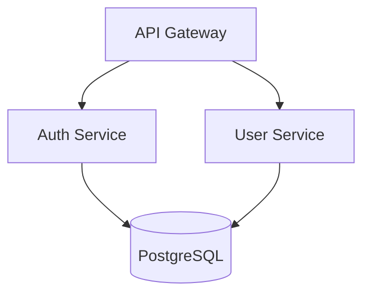

# Tools, Usage & Quality Bar

Read this when running the analysis tools, looking up CLI flags, formatting output, or
checking results against the quality bar.

## Quick Start

```bash
# Generate architecture diagram from project
python scripts/architecture_diagram_generator.py ./my-project --format mermaid

# Analyze dependencies for issues
python scripts/dependency_analyzer.py ./my-project --output json

# Get architecture assessment
python scripts/project_architect.py ./my-project --verbose
```

## Tools Overview

### 1. Architecture Diagram Generator

Generates architecture diagrams from project structure in multiple formats.

**Solves:** "I need to visualize my system architecture for documentation or team discussion"

**Input:** Project directory path
**Output:** Diagram code (Mermaid, PlantUML, or ASCII)

**Supported diagram types:**
- `component` - Shows modules and their relationships
- `layer` - Shows architectural layers (presentation, business, data)
- `deployment` - Shows deployment topology

**Usage:**
```bash
# Mermaid format (default)
python scripts/architecture_diagram_generator.py ./project --format mermaid --type component

# PlantUML format
python scripts/architecture_diagram_generator.py ./project --format plantuml --type layer

# ASCII format (terminal-friendly)
python scripts/architecture_diagram_generator.py ./project --format ascii

# Save to file
python scripts/architecture_diagram_generator.py ./project -o architecture.md
```

**Example output (Mermaid):**


### 2. Dependency Analyzer

Analyzes project dependencies for coupling, circular dependencies, and outdated packages.

**Solves:** "I need to understand my dependency tree and identify potential issues"

**Input:** Project directory path
**Output:** Analysis report (JSON or human-readable)

**Analyzes:**
- Dependency tree (direct and transitive)
- Circular dependencies between modules
- Coupling score (0-100)
- Outdated packages

**Supported package managers:**
- npm/yarn (`package.json`)
- Python (`requirements.txt`, `pyproject.toml`)
- Go (`go.mod`)
- Rust (`Cargo.toml`)

**Usage:**
```bash
# Human-readable report
python scripts/dependency_analyzer.py ./project

# JSON output for CI/CD integration
python scripts/dependency_analyzer.py ./project --output json

# Check only for circular dependencies
python scripts/dependency_analyzer.py ./project --check circular

# Verbose mode with recommendations
python scripts/dependency_analyzer.py ./project --verbose
```

**Example output:**
```
Dependency Analysis Report
==========================
Total dependencies: 47 (32 direct, 15 transitive)
Coupling score: 72/100 (moderate)

Issues found:
- CIRCULAR: auth → user → permissions → auth
- OUTDATED: lodash 4.17.15 → 4.17.21 (security)

Recommendations:
1. Extract shared interface to break circular dependency
2. Update lodash to fix CVE-2020-8203
```

### 3. Project Architect

Analyzes project structure and detects architectural patterns, code smells, and improvement opportunities.

**Solves:** "I want to understand the current architecture and identify areas for improvement"

**Input:** Project directory path
**Output:** Architecture assessment report

**Detects:**
- Architectural patterns (MVC, layered, hexagonal, microservices indicators)
- Code organization issues (god classes, mixed concerns)
- Layer violations
- Missing architectural components

**Usage:**
```bash
# Full assessment
python scripts/project_architect.py ./project

# Verbose with detailed recommendations
python scripts/project_architect.py ./project --verbose

# JSON output
python scripts/project_architect.py ./project --output json

# Check specific aspect
python scripts/project_architect.py ./project --check layers
```

**Example output:**
```
Architecture Assessment
=======================
Detected pattern: Layered Architecture (confidence: 85%)

Structure analysis:
  ✓ controllers/  - Presentation layer detected
  ✓ services/     - Business logic layer detected
  ✓ repositories/ - Data access layer detected
  ⚠ models/       - Mixed domain and DTOs

Issues:
- LARGE FILE: UserService.ts (1,847 lines) - consider splitting
- MIXED CONCERNS: PaymentController contains business logic

Recommendations:
1. Split UserService into focused services
2. Move business logic from controllers to services
3. Separate domain models from DTOs
```

## Tech Stack Coverage

**Languages:** TypeScript, JavaScript, Python, Go, Swift, Kotlin, Rust
**Frontend:** React, Next.js, Vue, Angular, React Native, Flutter
**Backend:** Node.js, Express, FastAPI, Go, GraphQL, REST
**Databases:** PostgreSQL, MySQL, MongoDB, Redis, DynamoDB, Cassandra
**Infrastructure:** Docker, Kubernetes, Terraform, AWS, GCP, Azure
**CI/CD:** GitHub Actions, GitLab CI, CircleCI, Jenkins

## Common Commands

```bash
# Architecture visualization
python scripts/architecture_diagram_generator.py . --format mermaid
python scripts/architecture_diagram_generator.py . --format plantuml
python scripts/architecture_diagram_generator.py . --format ascii

# Dependency analysis
python scripts/dependency_analyzer.py . --verbose
python scripts/dependency_analyzer.py . --check circular
python scripts/dependency_analyzer.py . --output json

# Architecture assessment
python scripts/project_architect.py . --verbose
python scripts/project_architect.py . --check layers
python scripts/project_architect.py . --output json
```

## Getting Help

1. Run any script with `--help` for usage information
2. Check reference documentation for detailed patterns and workflows
3. Use `--verbose` flag for detailed explanations and recommendations

## Troubleshooting

| Problem | Cause | Solution |
|---------|-------|----------|
| Diagram shows zero components | Project uses non-standard directory structure or all directories are in the ignore list (e.g., `node_modules`, `.venv`) | Ensure source code lives in named subdirectories at the project root, not solely in ignored folders |
| Circular dependency detection misses cycles | Import statements use aliases, dynamic imports, or barrel files that obscure the dependency chain | Run `dependency_analyzer.py --verbose` to inspect resolved module graph; refactor barrel re-exports into explicit imports |
| Coupling score always reads 0 | Project has only one internal module (flat file structure with no subdirectories) | Organize code into multiple top-level directories so the analyzer can map inter-module relationships |
| Layer assignment shows all directories as "unknown" | Directory names do not match built-in layer indicators (e.g., `src/` instead of `services/`, `controllers/`) | Rename directories to conventional names or use the JSON output to manually map layers in your ADR |
| `--format plantuml` output renders incorrectly | Component names contain special characters (brackets, quotes) that PlantUML cannot escape | Rename directories to use alphanumeric and hyphen characters only |
| Dependency parser reports 0 dependencies | Package manifest file (`package.json`, `requirements.txt`, `go.mod`, `Cargo.toml`) is missing or malformed | Verify the manifest exists in the project root and passes its native validation (`npm ls`, `pip check`, `go mod verify`) |
| Architecture assessment confidence below 30% | Project mixes multiple patterns or has a flat structure without clear layering | Pick a target pattern from `references/architecture_patterns.md` and restructure directories to match its conventions |

## Success Criteria

- **Coupling score below 30**: The dependency analyzer reports a coupling score under 30/100, indicating loosely coupled modules with clear boundaries.
- **Zero circular dependencies**: Running `dependency_analyzer.py --check circular` exits with code 0 and reports no cycles.
- **Zero layer violations**: Running `project_architect.py --check layers` detects no cross-layer dependency violations.
- **Architecture pattern confidence above 70%**: The project architect detects a recognized pattern (layered, clean, hexagonal, MVC) with at least 70% confidence.
- **No god classes detected**: Every class in the codebase stays below 300 lines, with no `god_class` issues in the assessment report.
- **Average file size under 250 lines**: The code quality metrics show `avg_file_lines` well below the 500-line threshold, indicating well-decomposed modules.
- **ADR created for every major decision**: Each architecture decision is documented using the ADR template from the database selection or pattern selection workflow.

## Tool Reference

### architecture_diagram_generator.py

- **Purpose**: Generates architecture diagrams from project directory structure in Mermaid, PlantUML, or ASCII format.
- **Usage**: `python scripts/architecture_diagram_generator.py <project_path> [flags]`
- **Flags**:

| Flag | Short | Type | Default | Description |
|------|-------|------|---------|-------------|
| `project_path` | -- | positional | required | Path to the project directory to scan |
| `--format` | `-f` | choice: `mermaid`, `plantuml`, `ascii` | `mermaid` | Output diagram format |
| `--type` | `-t` | choice: `component`, `layer`, `deployment` | `component` | Diagram type to generate |
| `--output` | `-o` | string | stdout | File path to write the diagram to |
| `--verbose` | `-v` | flag | off | Print scanning progress (components found, relationships, technologies) |
| `--json` | -- | flag | off | Output raw scan results as JSON instead of a diagram |

- **Example**:

```bash
python scripts/architecture_diagram_generator.py ./my-app --format mermaid --type layer -v
```

```
Scanning project: /home/user/my-app
Found 6 components
Found 4 relationships
Technologies: node, react, docker
graph TB
    subgraph Presentation Layer
        components["components"]
        pages["pages"]
    end

    subgraph Business Layer
        services["services"]
    end

    subgraph Data Layer
        models["models"]
        repositories["repositories"]
    end
```

- **Output Formats**: Mermaid diagram code (copy into any Mermaid renderer), PlantUML markup (render via PlantUML server), ASCII art (paste into terminal or plain-text docs), or raw JSON scan data (`--json`).

### dependency_analyzer.py

- **Purpose**: Analyzes project dependencies for coupling score, circular dependencies, and package health across multiple package managers.
- **Usage**: `python scripts/dependency_analyzer.py <project_path> [flags]`
- **Flags**:

| Flag | Short | Type | Default | Description |
|------|-------|------|---------|-------------|
| `project_path` | -- | positional | required | Path to the project directory to analyze |
| `--output` | `-o` | choice: `human`, `json` | `human` | Output format for the report |
| `--check` | -- | choice: `all`, `circular`, `coupling` | `all` | Restrict analysis to a specific check; `circular` exits non-zero if cycles found, `coupling` exits non-zero if score >70 |
| `--verbose` | `-v` | flag | off | Print progress details (package manager detected, dependency counts, module scan count) |
| `--save` | `-s` | string | none | Save JSON report to the specified file path |

- **Example**:

```bash
python scripts/dependency_analyzer.py ./my-app --output json --save report.json
```

```json
{
  "project_path": "/home/user/my-app",
  "package_manager": "npm",
  "summary": {
    "direct_dependencies": 23,
    "dev_dependencies": 15,
    "internal_modules": 8,
    "coupling_score": 42,
    "circular_dependencies": 1,
    "issues": 1
  },
  "circular_dependencies": [["auth", "user", "permissions", "auth"]],
  "recommendations": [
    "Extract shared interfaces or create a common module to break circular dependencies"
  ]
}
```

- **Output Formats**: Human-readable terminal report (default) with summary, issues, and recommendations; JSON structured report for CI/CD pipeline integration or programmatic consumption.

### project_architect.py

- **Purpose**: Detects architectural patterns, code organization issues, layer violations, and god classes in a project, then generates improvement recommendations.
- **Usage**: `python scripts/project_architect.py <project_path> [flags]`
- **Flags**:

| Flag | Short | Type | Default | Description |
|------|-------|------|---------|-------------|
| `project_path` | -- | positional | required | Path to the project directory to assess |
| `--output` | `-o` | choice: `human`, `json` | `human` | Output format for the assessment report |
| `--check` | -- | choice: `all`, `pattern`, `layers`, `code` | `all` | Restrict to a specific check; `pattern` prints detected pattern only, `layers` exits non-zero on violations, `code` exits non-zero on warnings |
| `--verbose` | `-v` | flag | off | Print analysis progress (pattern detection, issue counts, violation counts) |
| `--save` | `-s` | string | none | Save JSON report to the specified file path |

- **Example**:

```bash
python scripts/project_architect.py ./my-app --check layers --verbose
```

```
Analyzing project: /home/user/my-app
Detected pattern: layered (confidence: 78%)
Found 2 code issues
Found 1 layer violations
Found 1 layer violation(s):
  controllers/PaymentController.ts: presentation layer should not depend on infrastructure layer
```

- **Output Formats**: Human-readable terminal report (default) with pattern detection, layer assignments, code issues, and prioritized recommendations; JSON structured report for automated quality gates and dashboard integration.
