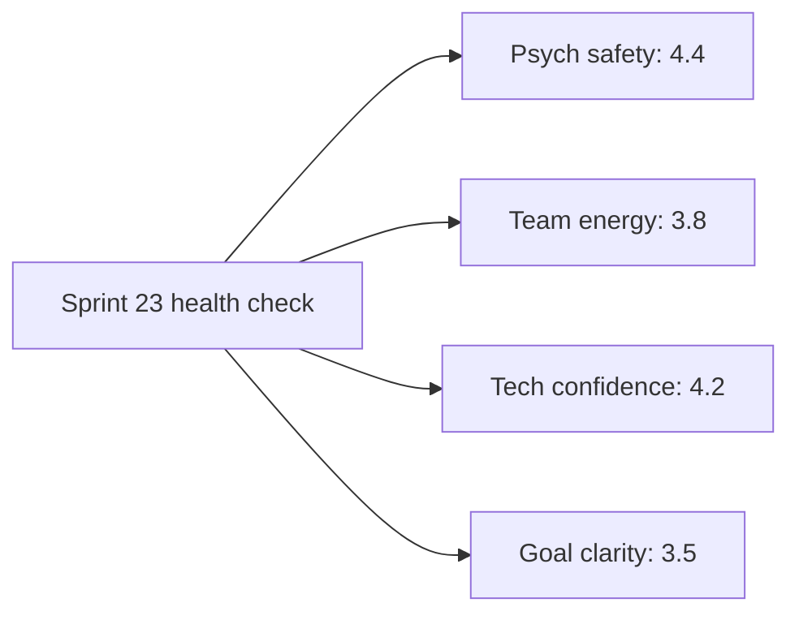

# Example: Data-Driven Retrospective for Sprint 23

> Real-world scenario showing how to apply this skill end-to-end.

## Context

Acme Analytics' Search Platform team (B2B analytics SaaS, Series B, 80 people) -- 7 engineers + 1 designer + 1 PM -- has just closed Sprint 23 (May 5 to May 21, 2026). Sprint 23 closed with 38 points completed against 32 committed (118%). At first glance that looks great; the Scrum Master (Mira) is suspicious because the previous five sprints averaged 60% delivery. She suspects carry-over from Sprint 22 inflated the number, and the team's energy in the retro will reveal the real story.

This retro is structured around data, not feelings. Mira pre-prepares the data pack -- velocity trend, code-churn analytics, blocker resolution time, action-item follow-through -- and walks the team through it before the conversation starts.

## Inputs

- Sprint 23 closed state (38 points completed, 32 committed)
- Sprint 18-23 historical data
- Code-churn analytics from GitHub for the sprint window
- Action items from the Sprint 22 retro and their completion status
- 7 engineers + 1 designer + 1 PM attending; 90-minute retro

## Applying the skill

1. **Pull the data** for sprint 23 + history; render the trend visuals before the retro.
2. **Open the retro with the data pack** (15 min). Everyone is looking at the same picture.
3. **Run the structured retro** (60 min): What Worked, What Didn't, What to Try.
4. **Score action items from last retro** (5 min): closed loop on commitments.
5. **Produce the retro doc** with action items + owners + due dates.

## The artifact

### Command 1: pull sprint data

```bash
python scripts/retrospective_analyzer.py --input sprint_23_data.json --format markdown --output retro_pack.md
```

#### Output (data pack excerpt)

```
=== Sprint 23 Retro Data Pack ===

Sprint:               23
Period:               2026-05-05 to 2026-05-21 (12 working days)
Team size:            7 eng + 1 design + 1 PM
Commitment:           32 points
Completed:            38 points (118%)
Carry-over from S22:  14 points (already counted in S22's 24 completed... double-check)

ADJUSTMENT: of the 38 points "completed" in S23, 14 were tickets actually finished in S22 but
not closed until S23. True S23 net velocity: 24 points. Pattern detected.

=== Velocity trend (last 6 sprints) ===

Sprint   Committed   Completed   Real net (adj for carry)
S18      32          28          28
S19      30          18          18
S20      28          26          26
S21      34          22          22
S22      30          24          38 (= reported S22 24 + closure-late 14)
S23      32          38          24 (= reported 38 - 14 carry-over)

Adjusted mean: 26.0 (no change)
Adjusted CV: 18.7% (down from 25.4% pre-adjustment)

INSIGHT: Velocity is more stable than it appears. The volatility was from inconsistent
"closed at end of sprint" hygiene, not actual delivery instability.
```

#### Code-churn analytics

```
=== Code-churn (GitHub commits in window) ===

Commits:               142
PRs merged:            38
PRs > 500 LOC:         8 (21%) -- target <15%, ABOVE
Same-day reverts:      3 (8%) -- target <5%, ABOVE
WIP at sprint end:     6 in-progress PRs -- target <=4, slight ABOVE

Top files churned 3+ times:
- search/index_builder.py    (4 commits, 3 PRs)  -- expected, index rebuild
- search/query_planner.py     (3 commits)         -- expected, plan rewrite
- api/admin_routes.py         (5 commits)         -- UNEXPECTED, three small fixes

INSIGHT: Three small fixes on admin_routes.py suggest rushed work or unclear acceptance.
```

#### Blocker analytics

```
=== Blocker resolution (S23) ===

Blockers logged:        7
Median time to resolve: 1.1 days (target <=2)
Worst blocker:          BQ access (4.2 days) -- escalated to Devraj

INSIGHT: blocker hygiene improved -- 6 of 7 resolved within SLA. Notable.
```

#### Action items from Sprint 22

```
=== Action item follow-through (S22 retro) ===

A1: Implement "no mid-sprint scope add" policy             - DONE
A2: Right-size commitment using Monte Carlo                - DONE (32 vs S22's 30)
A3: Pre-allocate 10% incident reserve                       - NOT DONE (no incident occurred)
A4: Define done-vs-merged hygiene                           - NOT DONE
A5: WWAS-format acceptance criteria on all stories          - PARTIAL (62% of S23 stories)

Follow-through: 2.5 / 5 = 50%
```

### The retro session (90 min)

#### Phase 1: Data review (15 min)

Mira screen-shares the data pack. She names the headline:

> "Sprint 23 looks great by completed points -- 118% -- but 14 of those points were S22 carry-over closed late. True net was 24 points. The interesting result is that adjusted velocity is more stable than we thought: CV is 18.7%, not 25.4%. We do not have a velocity problem. We have a *hygiene* problem about when we mark things done."

Team digests for 5 minutes. Two engineers visibly relax.

#### Phase 2: What worked (15 min)

The team brainstorms; Mira clusters:

- **Latency win shipped on time.** Search p95 from 480ms to 210ms. The two engineers who paired called out that pairing was the key.
- **Blocker resolution was sharp.** 6 of 7 inside SLA. New "stuck for >24h, message in #search-blockers" norm is working.
- **Design partner cohort responded fast to synonym expansion.** Beta data came back inside 48 hours.
- **No mid-sprint scope adds.** PM held the line; the team noticed and appreciated it.
- **Two engineers proactively pulled in carry-over from S22 instead of starting new work.** Should be standard but worth naming.

#### Phase 3: What didn't work (20 min)

- **admin_routes.py had 5 commits and 3 small fixes.** Engineer Sarah named it: the original ticket lacked clear acceptance criteria; she shipped the happy path, missed two edge cases, then patched.
- **6 in-progress PRs at sprint end.** The team agreed: a pre-commit norm that PRs should be either merged or moved back to In Progress 24 hours before sprint close would have caught the carry-over.
- **WWAS adoption at 62%.** PM is behind on rewriting older items. Two engineers said the WWAS items are noticeably easier to start work on.
- **Action item A3 (incident reserve) was a no-op** because no incident happened. Engineer suggested: track the reserve as a *separate* number in capacity, not as a phantom "we kept it in reserve" claim.
- **The BQ access blocker** took 4.2 days because the request went through three Slack channels. Process suggestion: one named "BQ access intake" person on rotation.

#### Phase 4: What to try (next sprint) (20 min)

The team votes on what to commit to in Sprint 24:

| Action | Votes | Owner | Due |
|--------|-------|-------|-----|
| Adopt "merge or revert 24h before close" PR hygiene | 8/9 | Sarah (Eng Lead) | S24 start |
| All S24 stories in WWAS format before sprint planning | 7/9 | Priya (PM) | 2026-05-29 |
| BQ access intake rotation (one person per sprint) | 6/9 | Devraj (Sr PM) | S24 start |
| Track incident reserve as a separate capacity line | 6/9 | Mira (SM) | S24 start |
| Done-vs-merged hygiene check at midpoint of sprint | 5/9 | Sarah | S24 day 6 |

#### Phase 5: Action follow-through commitment (5 min)

Mira reminds: "Last sprint we finished 2.5 of 5 actions. Let's aim for 4 of 5 this sprint." Everyone agrees to be checked on Day 6.

#### Phase 6: Quick health-check (5 min)

Each team member rates Sprint 23 on a scale of 1-5 for: psychological safety, team energy, technical confidence, sprint goal clarity.



**Insight:** Goal clarity is the lowest (3.5). Team feedback: "We had the goal but the acceptance criteria for half the stories were fuzzy." This is exactly the WWAS problem.

### Retro doc (final artifact)

---

#### Sprint 23 Retro -- Search Platform

**Date:** 2026-05-22
**Facilitator:** Mira (Scrum Master)
**Attendees:** 9 (7 eng + 1 design + 1 PM)
**Sprint window:** 2026-05-05 to 2026-05-21

#### Headline

Sprint 23 was a successful sprint (latency win shipped, blockers managed well) but the reported 118% commitment was inflated by S22 carry-over closure. True net was 24 points. Adjusted velocity is more stable than we thought (CV 18.7%). The opportunity is hygiene -- when we mark things done, how we write acceptance criteria, and how we handle in-progress PRs at sprint close.

#### What worked (data-backed)

- Search latency win shipped on schedule (p95 480ms -> 210ms)
- Blocker resolution: 6/7 inside SLA (median 1.1 days)
- No mid-sprint scope adds (S22 action item A1 sticking)
- Design partner cohort responded inside 48 hours

#### What didn't work (data-backed)

- 14 points of S22 work closed in S23 -- inflates apparent velocity
- 6 in-progress PRs at sprint end (target <=4)
- admin_routes.py churn (5 commits, 3 small fixes) due to fuzzy acceptance criteria
- WWAS adoption only 62%; goal clarity score 3.5
- Action item A3 was no-op; reserve not tracked separately

#### Action items for Sprint 24

| # | Action | Owner | Due | Status check |
|---|--------|-------|-----|--------------|
| 1 | "Merge or revert 24h before close" PR hygiene | Sarah | S24 start | Day 6 + day 11 |
| 2 | All S24 stories in WWAS before planning | Priya | 2026-05-29 | Planning day |
| 3 | BQ access intake rotation | Devraj | S24 start | Mid-sprint |
| 4 | Track incident reserve separately in capacity | Mira | S24 start | Planning |
| 5 | Done-vs-merged check at sprint midpoint | Sarah | S24 day 6 | Day 6 standup |

**Target follow-through: 4 of 5 (last sprint: 2.5 of 5).**

#### Team health-check

| Dimension | Score (5) |
|-----------|-----------|
| Psychological safety | 4.4 |
| Team energy | 3.8 |
| Technical confidence | 4.2 |
| Goal clarity | 3.5 |

---

## Why this works

- The retro opened with adjusted data, not feelings. The "true velocity is 24, not 38" insight reframed the whole conversation.
- The data pack uses three independent lenses (velocity, code churn, blocker time) so the team cannot dismiss one signal.
- The previous sprint's action items were scored explicitly. 50% follow-through is named, not hidden.
- Actions are owned, dated, and have midpoint check-ins. Each action targets a specific data point that the next retro can re-measure.
- The health-check is quick and visible. Goal clarity at 3.5 is the through-line that explains both admin_routes.py churn and WWAS adoption gap.
- The headline section makes the retro doc readable in 60 seconds for anyone outside the team (engineering lead, VP Product).

## What's next

- Mira will check action progress on Day 6 of Sprint 24 (per Action #5).
- Run `../scrum-master/scripts/sprint_health_scorer.py` after S24 closes; expect Commitment Reliability and Story Completion to improve.
- Mirror the retro insights to the `../execution/status-update-generator/` weekly update if anything board-relevant emerged (latency win, yes).
- Use `../execution/wwas/` patterns to fix the WWAS adoption gap before next planning.
- Re-run this retro structure each sprint; archive prior retros for trend visibility.
