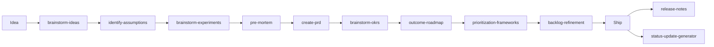

# Project Management Skills

!!! success "★ The most-visited domain in Claude Skills"
    **42 production-ready PM skills** spanning discovery, execution, career growth, and tool integrations. PMs from APM to CPO use these daily to ship faster with fewer meetings.

The PM domain is a complete operating system for product and project work — every artifact a PM produces (PRD, OKR, roadmap, status update, retro, decision log) has a skill that scaffolds it, with portable output to Jira, Linear, Notion, or Confluence.

[:material-folder-open: Browse on GitHub](https://github.com/borghei/Claude-Skills/tree/main/project-management){ .md-button .md-button--primary }
[:material-rocket-launch: Install pm-starter-pack](https://github.com/borghei/Claude-Skills/blob/main/bundles.json){ .md-button }

---

## Why PMs choose this

<div class="grid cards" markdown>

-   :material-folder-multiple:{ .lg .middle } __42 skills, full lifecycle__

    ---

    Every stage covered: discovery → definition → execution → delivery → launch → career growth. No gaps to plug with other tools.

-   :material-export:{ .lg .middle } __Portable artifacts__

    ---

    One skill, six output formats — push to Jira, Linear, Notion, Confluence, or GitHub Projects without rewrites.

-   :material-language-python:{ .lg .middle } __Real automation__

    ---

    15+ Python tools you can pipe into CI, scripts, or MCP servers. Standard library only — no `pip install` cliffs.

-   :material-school:{ .lg .middle } __Career growth included__

    ---

    Interview prep, career ladder, onboarding, 1:1 templates. No competitor PM tool covers this.

</div>

---

## Quick Start by Role

Pick your role and start with the 3-4 skills that match your daily work:

=== "Associate PM"

    Foundations: write your first PRD, structure your backlog, plan your growth.

    1. [`create-prd/`](https://github.com/borghei/Claude-Skills/blob/main/project-management/execution/create-prd/SKILL.md) — 8-section PRD scaffolding
    2. [`wwas/`](https://github.com/borghei/Claude-Skills/blob/main/project-management/execution/wwas/SKILL.md) — Why-What-Acceptance backlog items
    3. [`career/pm-onboarding/`](https://github.com/borghei/Claude-Skills/tree/main/project-management/career/pm-onboarding) — 30-60-90 day plan
    4. [`career/pm-interview-prep/`](https://github.com/borghei/Claude-Skills/tree/main/project-management/career/pm-interview-prep) — Land your next role

=== "PM"

    The core PM loop: discovery → prioritize → execute → communicate.

    1. [`discovery/brainstorm-ideas/`](https://github.com/borghei/Claude-Skills/tree/main/project-management/discovery/brainstorm-ideas) → [`discovery/identify-assumptions/`](https://github.com/borghei/Claude-Skills/tree/main/project-management/discovery/identify-assumptions) — Product Trio discovery
    2. [`execution/prioritization-frameworks/`](https://github.com/borghei/Claude-Skills/tree/main/project-management/execution/prioritization-frameworks) — RICE, ICE, MoSCoW, Opportunity Score
    3. [`execution/status-update-generator/`](https://github.com/borghei/Claude-Skills/tree/main/project-management/execution/status-update-generator) — Weekly exec update from Jira/Linear data
    4. [`examples/feature-end-to-end.md`](https://github.com/borghei/Claude-Skills/blob/main/project-management/examples/feature-end-to-end.md) — Idea → release notes in 6 commands

=== "Senior PM / Group PM"

    Portfolio thinking, metrics trees, exec communication.

    1. [`senior-pm/`](https://github.com/borghei/Claude-Skills/tree/main/project-management/senior-pm) — Portfolio, stakeholder mapping, EMV risk
    2. [`execution/north-star-metric/`](https://github.com/borghei/Claude-Skills/tree/main/project-management/execution/north-star-metric) — NSM + input metric tree
    3. [`execution/roadmap-communication/`](https://github.com/borghei/Claude-Skills/tree/main/project-management/execution/roadmap-communication) — Exec / customer / internal roadmap variants
    4. [`execution/daci-framework/`](https://github.com/borghei/Claude-Skills/tree/main/project-management/execution/daci-framework) — Decision facilitation at scale

=== "Scrum Master"

    Sprint mechanics, refinement, splitting, retros.

    1. [`scrum-master/`](https://github.com/borghei/Claude-Skills/tree/main/project-management/scrum-master) — Sprint analytics, velocity, capacity
    2. [`execution/backlog-refinement/`](https://github.com/borghei/Claude-Skills/tree/main/project-management/execution/backlog-refinement) — INVEST + DoR/DoD + splitting
    3. [`execution/story-splitting/`](https://github.com/borghei/Claude-Skills/tree/main/project-management/execution/story-splitting) — 9 splitting patterns (Lawrence)
    4. [`sprint-retrospective/`](https://github.com/borghei/Claude-Skills/tree/main/project-management/sprint-retrospective) — Data-driven retros

=== "Delivery / Release Manager"

    Launches, flow metrics, release comms.

    1. [`delivery-manager/`](https://github.com/borghei/Claude-Skills/tree/main/project-management/delivery-manager) — Release coordination, incident response
    2. [`execution/launch-playbook/`](https://github.com/borghei/Claude-Skills/tree/main/project-management/execution/launch-playbook) — Internal + external launch coordination
    3. [`execution/cycle-time-analyzer/`](https://github.com/borghei/Claude-Skills/tree/main/project-management/execution/cycle-time-analyzer) — Flow metrics (Little's Law, CFD)
    4. [`execution/release-notes/`](https://github.com/borghei/Claude-Skills/tree/main/project-management/execution/release-notes) — User-facing release comms

=== "Program Manager"

    Multi-team coordination, dependencies, governance.

    1. [`program-manager/`](https://github.com/borghei/Claude-Skills/tree/main/project-management/program-manager) — Multi-project coordination
    2. [`execution/dependency-map/`](https://github.com/borghei/Claude-Skills/tree/main/project-management/execution/dependency-map) — Cross-team blockers + critical path
    3. [`execution/daci-framework/`](https://github.com/borghei/Claude-Skills/tree/main/project-management/execution/daci-framework) — Cross-team decision governance
    4. [`execution/roadmap-communication/`](https://github.com/borghei/Claude-Skills/tree/main/project-management/execution/roadmap-communication) — Stakeholder-specific roadmaps

=== "Head of Product / CPO"

    Strategy, NSM, OKRs, team rubrics.

    1. [`execution/north-star-metric/`](https://github.com/borghei/Claude-Skills/tree/main/project-management/execution/north-star-metric) — Define the NSM + input tree
    2. [`execution/outcome-roadmap/`](https://github.com/borghei/Claude-Skills/tree/main/project-management/execution/outcome-roadmap) — Output → outcome transformation
    3. [`execution/brainstorm-okrs/`](https://github.com/borghei/Claude-Skills/tree/main/project-management/execution/brainstorm-okrs) — OKR brainstorming (Wodtke)
    4. [`career/pm-career-ladder/`](https://github.com/borghei/Claude-Skills/tree/main/project-management/career/pm-career-ladder) — Rubrics for your team

---

## Skill catalog

### Role-based (12 skills)

| Skill | Focus | Python tools |
|---|---|:---:|
| [senior-pm](https://github.com/borghei/Claude-Skills/tree/main/project-management/senior-pm) | Portfolio, stakeholder mapping, EMV risk | 4 |
| [scrum-master](https://github.com/borghei/Claude-Skills/tree/main/project-management/scrum-master) | Sprint analytics, velocity, team health | 4 |
| [delivery-manager](https://github.com/borghei/Claude-Skills/tree/main/project-management/delivery-manager) | Release management, incident response | — |
| [program-manager](https://github.com/borghei/Claude-Skills/tree/main/project-management/program-manager) | Multi-project coordination | — |
| [agile-coach](https://github.com/borghei/Claude-Skills/tree/main/project-management/agile-coach) | Agile transformation, coaching | — |
| [jira-expert](https://github.com/borghei/Claude-Skills/tree/main/project-management/jira-expert) | Jira admin, JQL, automation | — |
| [linear-expert](https://github.com/borghei/Claude-Skills/tree/main/project-management/linear-expert) ★ NEW | Linear GraphQL, Jira → Linear migration | — |
| [confluence-expert](https://github.com/borghei/Claude-Skills/tree/main/project-management/confluence-expert) | Documentation, knowledge management | — |
| [notion-pm](https://github.com/borghei/Claude-Skills/tree/main/project-management/notion-pm) ★ NEW | Notion DBs for PRDs/OKRs/Roadmap/Decisions | — |
| [atlassian-admin](https://github.com/borghei/Claude-Skills/tree/main/project-management/atlassian-admin) | Atlassian suite administration | — |
| [atlassian-templates](https://github.com/borghei/Claude-Skills/tree/main/project-management/atlassian-templates) | Jira/Confluence templates | — |
| [sprint-retrospective](https://github.com/borghei/Claude-Skills/tree/main/project-management/sprint-retrospective) | Data-driven sprint retros | 4 |

### Discovery (5 skills)

| Skill | Focus | Framework |
|---|---|---|
| [brainstorm-ideas](https://github.com/borghei/Claude-Skills/tree/main/project-management/discovery/brainstorm-ideas) | Product Trio ideation | Opportunity Solution Tree |
| [brainstorm-experiments](https://github.com/borghei/Claude-Skills/tree/main/project-management/discovery/brainstorm-experiments) | Lean experiment design | XYZ Hypothesis |
| [identify-assumptions](https://github.com/borghei/Claude-Skills/tree/main/project-management/discovery/identify-assumptions) | Assumption mapping | 4-8 risk categories |
| [pre-mortem](https://github.com/borghei/Claude-Skills/tree/main/project-management/discovery/pre-mortem) | Pre-launch risk analysis | Tiger/Paper Tiger/Elephant |
| [interview-synthesis](https://github.com/borghei/Claude-Skills/tree/main/project-management/discovery/interview-synthesis) ★ NEW | Interview → opportunity tree | JTBD + Opportunity tree |

### Execution (21 skills)

| Skill | Focus | Framework |
|---|---|---|
| [create-prd](https://github.com/borghei/Claude-Skills/tree/main/project-management/execution/create-prd) | 8-section PRD scaffolding | PRD canonical |
| [prfaq](https://github.com/borghei/Claude-Skills/tree/main/project-management/execution/prfaq) ★ NEW | Working Backwards PR/FAQ | Amazon Bezos PRFAQ |
| [brainstorm-okrs](https://github.com/borghei/Claude-Skills/tree/main/project-management/execution/brainstorm-okrs) | OKR brainstorming | Wodtke Radical Focus |
| [north-star-metric](https://github.com/borghei/Claude-Skills/tree/main/project-management/execution/north-star-metric) ★ NEW | NSM + input metric tree | Ellis + Amplitude |
| [outcome-roadmap](https://github.com/borghei/Claude-Skills/tree/main/project-management/execution/outcome-roadmap) | Output → outcome roadmap | Now/Next/Later |
| [roadmap-communication](https://github.com/borghei/Claude-Skills/tree/main/project-management/execution/roadmap-communication) ★ NEW | Exec/customer/internal variants | Cagan right-sizing |
| [prioritization-frameworks](https://github.com/borghei/Claude-Skills/tree/main/project-management/execution/prioritization-frameworks) | 9-framework scoring | RICE, ICE, MoSCoW, ... |
| [backlog-refinement](https://github.com/borghei/Claude-Skills/tree/main/project-management/execution/backlog-refinement) ★ NEW | INVEST + DoR/DoD + splitting | INVEST (Wake) |
| [story-splitting](https://github.com/borghei/Claude-Skills/tree/main/project-management/execution/story-splitting) ★ NEW | Vertical slicing patterns | Lawrence's 9 patterns |
| [story-mapping](https://github.com/borghei/Claude-Skills/tree/main/project-management/execution/story-mapping) | User story mapping | Jeff Patton |
| [job-stories](https://github.com/borghei/Claude-Skills/tree/main/project-management/execution/job-stories) | JTBD backlog format | When/Want/So (Klement) |
| [wwas](https://github.com/borghei/Claude-Skills/tree/main/project-management/execution/wwas) | Why-What-Acceptance | WWAS |
| [cycle-time-analyzer](https://github.com/borghei/Claude-Skills/tree/main/project-management/execution/cycle-time-analyzer) ★ NEW | Flow metrics, CFD, Little's Law | Vacanti Kanban metrics |
| [dependency-map](https://github.com/borghei/Claude-Skills/tree/main/project-management/execution/dependency-map) ★ NEW | Cross-team blockers, critical path | CPM + DSM + Conway |
| [status-update-generator](https://github.com/borghei/Claude-Skills/tree/main/project-management/execution/status-update-generator) ★ NEW | Weekly exec update | SBNR + R/Y/G |
| [summarize-meeting](https://github.com/borghei/Claude-Skills/tree/main/project-management/execution/summarize-meeting) | Meeting summaries | Actions + decisions |
| [daci-framework](https://github.com/borghei/Claude-Skills/tree/main/project-management/execution/daci-framework) | Decision facilitation | DACI |
| [beta-program](https://github.com/borghei/Claude-Skills/tree/main/project-management/execution/beta-program) ★ NEW | Closed beta playbook | Kano + cohort design |
| [launch-playbook](https://github.com/borghei/Claude-Skills/tree/main/project-management/execution/launch-playbook) ★ NEW | Launch coordination | Alpha/beta/GA + RACI |
| [release-notes](https://github.com/borghei/Claude-Skills/tree/main/project-management/execution/release-notes) | Release notes generation | Category-based |
| [eol-communication](https://github.com/borghei/Claude-Skills/tree/main/project-management/execution/eol-communication) | End-of-life messaging | Sunset playbook |

### Career growth (4 skills) — ★ NEW sub-domain

| Skill | Focus | Framework |
|---|---|---|
| [pm-interview-prep](https://github.com/borghei/Claude-Skills/tree/main/project-management/career/pm-interview-prep) | APM → Group PM interview prep | CIRCLES + STAR + Decode and Conquer |
| [pm-career-ladder](https://github.com/borghei/Claude-Skills/tree/main/project-management/career/pm-career-ladder) | Rubrics + growth + promo packets | Square/Stripe ladders |
| [pm-onboarding](https://github.com/borghei/Claude-Skills/tree/main/project-management/career/pm-onboarding) | 30-60-90 day plan | Watkins First 90 Days + STARS |
| [pm-1on1s](https://github.com/borghei/Claude-Skills/tree/main/project-management/career/pm-1on1s) | 1:1 templates by partner type | Radical Candor + GROW |

---

## Worked example

See [`feature-end-to-end.md`](https://github.com/borghei/Claude-Skills/blob/main/project-management/examples/feature-end-to-end.md) for a complete walkthrough: idea → assumptions → experiment → PRD → OKRs → backlog → release notes in **6 commands**.



---

## Tool integrations

| Tool | Skill | Push direction |
|---|---|---|
| **Jira** | [`jira-expert/`](https://github.com/borghei/Claude-Skills/tree/main/project-management/jira-expert) | Issues, sprints, JQL, automation |
| **Linear** ★ NEW | [`linear-expert/`](https://github.com/borghei/Claude-Skills/tree/main/project-management/linear-expert) | Issues, cycles, projects, initiatives |
| **Confluence** | [`confluence-expert/`](https://github.com/borghei/Claude-Skills/tree/main/project-management/confluence-expert) | Pages, spaces, templates |
| **Notion** ★ NEW | [`notion-pm/`](https://github.com/borghei/Claude-Skills/tree/main/project-management/notion-pm) | DB-driven PRDs, OKRs, roadmaps |
| **Atlassian MCP** | (any) | Direct MCP server integration |
| **GitHub Projects** | (any) | Via `gh` CLI |

Every PM Python tool supports `--format json|markdown|mermaid|confluence|notion|linear`. See the [`SHARED_OUTPUT_SCHEMA.md`](https://github.com/borghei/Claude-Skills/blob/main/project-management/SHARED_OUTPUT_SCHEMA.md).

---

## Installation

=== "All PM skills (bundle)"

    ```bash
    npx @borghei/claude-skills add pm-starter-pack
    ```

=== "Individual skills"

    ```bash
    npx @borghei/claude-skills add senior-pm
    npx @borghei/claude-skills add status-update-generator
    npx @borghei/claude-skills add pm-interview-prep
    npx @borghei/claude-skills add linear-expert
    npx @borghei/claude-skills add notion-pm
    ```

=== "Other bundles"

    ```bash
    npx @borghei/claude-skills add pm-scrum-master      # Scrum Master toolkit
    npx @borghei/claude-skills add pm-discovery-coach   # Discovery flow
    npx @borghei/claude-skills add pm-career-track      # Career growth
    ```

**Supported assistants:** Claude Code, Cursor, Codex, Gemini CLI, Copilot, Windsurf, Cline, Aider, Goose, OpenCode.

---

## Success metrics

| Metric | Target |
|---|---|
| Sprint Predictability | +40% improvement |
| Project On-Time Delivery | +25% improvement |
| Atlassian/Linear Operations Efficiency | +70% time savings |
| Weekly Status Update Time | 4 hr → 20 min |
| PM Onboarding Time | 90 days → 30 days |
| Stakeholder Communication Coverage | 100% mapped |
