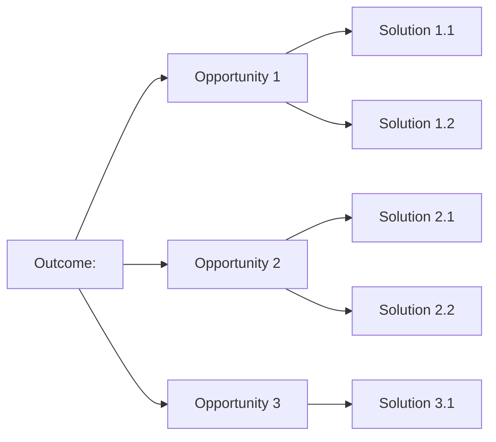

# Opportunity Solution Tree Template

**Outcome:** [State the measurable outcome at the top -- e.g., "Reduce time-to-close from 14 days to 5 days by Q3"]

**Outcome metric:** [How will you measure success?]
**Current baseline:** [Today's value]
**Target:** [Goal value]
**Owner:** [PM name]

---

## Opportunities

> Each opportunity is a customer need, pain, or desire -- not a feature.
> Each opportunity traces to >=1 themed insight from interview synthesis.

### Opportunity 1: [Customer-side framing]

**Evidence:** [Link to Theme 1, Theme 4 from synthesis]
**Strength:** [1-3, from theme strength scores]
**Affected segment(s):** [e.g., Senior Finance Leads at enterprise accounts]

**Candidate solutions:**

| ID | Solution | Effort (T-shirt) | Confidence | Notes |
|----|----------|------------------|------------|-------|
| S1.1 | [Solution description] | M | Low | Needs experiment X |
| S1.2 | [Solution description] | S | Medium | Adjacent team has prototype |
| S1.3 | Do nothing (baseline) | - | - | Required comparison |

### Opportunity 2: [Customer-side framing]

**Evidence:** [Link to Theme 2 from synthesis]
**Strength:** [1-3]
**Affected segment(s):** [Segment]

**Candidate solutions:**

| ID | Solution | Effort | Confidence | Notes |
|----|----------|--------|------------|-------|
| S2.1 | [Solution description] | L | Medium | |
| S2.2 | [Solution description] | S | High | |

### Opportunity 3: [Customer-side framing]

**Evidence:** [Link to Theme 3 from synthesis]
**Strength:** [1-3]
**Affected segment(s):** [Segment]

**Candidate solutions:**

| ID | Solution | Effort | Confidence | Notes |
|----|----------|--------|------------|-------|
| S3.1 | [Solution description] | M | Low | |

---

## Mermaid view

---

## Selected next experiment

**Solution under test:** [ID and description]
**Hypothesis:** We believe that [solution] will cause [opportunity] to be addressed, measured by [metric] moving from [baseline] to [target] within [time].
**Experiment owner:** [Name]
**Decision date:** [When the team will review results]

---

## Open questions for next discovery round

1. [Follow-up question 1]
2. [Follow-up question 2]
3. [Follow-up question 3]
