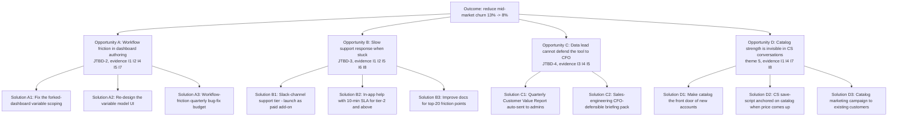

# Example: Wayfinder Analytics — Synthesizing 8 Customer Interviews into an Opportunity Solution Tree

> Real-world scenario showing how to apply this skill end-to-end.

## Context

Wayfinder Analytics (Series-B B2B analytics platform, ~180 employees, ~3,200 paying accounts) just completed an 8-interview churn investigation following the customer-interview-script skill. The 8 interviews comprised 4 recently-churned customers and 4 at-risk customers, all mid-market data team leads. The PM (Anita Vasquez) has the raw transcripts, Dovetail clips, and notes from the note-taker.

The team has 5 days before the quarterly planning offsite. Anita needs to convert 8 hours of recordings into an opportunity solution tree that her team can defend, and into a list of follow-up questions to close any remaining evidence gaps. The interview-synthesis skill is being applied end-to-end.

## Inputs

- 8 interview transcripts (~10K-15K words each)
- Going-in hypothesis: stated churn reason ("too expensive") is downstream of an unstated root cause
- Going-in opportunity space: unknown — Anita is synthesizing without a prior tree
- Team: Anita (PM), Daniel (APM, notetaker), Liang (Designer, reading along)
- Constraint: 5 days
- Constraint: output must be share-ready for cross-functional offsite

## Applying the skill

1. **Extracted snippets first.** Each transcript was read for stories, contradictions, surprises, and emotions. Did NOT skip to themes. 142 snippets total across 8 interviews.
2. **Coded each snippet** with need / job / pain / gain codes. Did this individually (Anita) then reviewed jointly with Daniel and Liang to align.
3. **Clustered by need code.** Not by interview, not by feature, not by team's prior assumptions. By the customer's underlying need.
4. **Built the opportunity solution tree.** Each opportunity has a citation: which interviews supported it, with snippet IDs.
5. **Marked contradictions and surprises.** These are the high-signal moves; they get called out separately.
6. **Generated a follow-up question list.** Specifically the assumptions that 8 interviews did not yet validate.

## The artifact

```
================================================================
  WAYFINDER CHURN INVESTIGATION — SYNTHESIS
  Sample:   8 interviews (4 churned, 4 at-risk)
  Period:   2026-04-15 to 2026-05-19
  Owner:    Anita Vasquez (PM)
  Drafted:  2026-05-22
================================================================


PART 1 — SAMPLE OVERVIEW

  ID  Company       Status     Tenure  Role
  --  ------------  ---------  ------  ---------------------
  I1  PolySigma     Churned    14 mo   Sr Data Lead (Brian)
  I2  Helios        Churned    11 mo   Analytics Manager
  I3  Northpoint    Churned     8 mo   Data Engineering Lead
  I4  Quantis       Churned    19 mo   Director of Analytics
  I5  Ridgeway      At-risk     7 mo   Head of Data
  I6  Vellum AI     At-risk    16 mo   Senior Data Scientist
  I7  Cabra Foods   At-risk     9 mo   BI Lead
  I8  Stellar Logix At-risk    13 mo   Director of Data

  Total transcript: ~92K words
  Snippet count:   142 (avg 17.8 per interview)


PART 2 — TOP NEED CODES (BY VOLUME ACROSS INTERVIEWS)

Need code                            Mentioned in (of 8)
---------------------------------    ------------------
workflow-flow-without-friction       7 / 8
quick-help-when-stuck                6 / 8
non-data-users-self-serve            5 / 8
data-cataloging-confidence           4 / 8  *positive
trust-in-numbers-i-share             4 / 8
build-faster-than-the-question       3 / 8
keep-tool-cost-justifiable           3 / 8

* the only need code where Wayfinder is rated POSITIVELY


PART 3 — THEMES

THEME 1 — Workflow friction in dashboard authoring is the
          load-bearing churn driver.
  Evidence: I1, I2, I4, I5, I7 explicitly cite forks-not-
  working, variables not scoping as expected, or "fighting
  the platform". I3 and I6 cite it indirectly.

  Pattern: "Each one was small. They added up." (I1, Brian).
  Echoed almost verbatim by I4 ("death by a thousand cuts").
  This is the synthesis-level finding.

THEME 2 — Support response time amplifies friction into
          frustration.
  Evidence: I1, I2, I5, I6, I8 — five customers spontaneously
  brought up support response time. Average wait quoted:
  4-24 hours. Two of the five named Sigma's Slack-channel
  response time (10 min) as a contrast.

THEME 3 — Stated churn reason ("too expensive") is
          systematically wrong for at least 3 of 4 churned
          customers.
  Evidence: I1 (Brian, explicit retraction during interview).
  I2 said "honestly the price was fine, the time wasn't."
  I4 said "we'd have paid double if it worked the way I
  wanted it to."
  Only I3 had a real budget cut as the proximate cause —
  and even there, the budget cut would have spared an A-tier
  tool.

THEME 4 — Non-data users self-serving is the data lead's
          success metric, not feature richness or price.
  Evidence: I1, I2, I3, I5, I7. The data lead's job is "stop
  the Slack pings." Anything that helps non-data users
  answer their own questions is high-leverage.

THEME 5 — Wayfinder's data cataloging is genuinely better
          than the alternatives.
  Evidence: I1, I4, I7, I8 — volunteered. "The catalog was
  the only thing I genuinely missed when we moved to Sigma."
  (I4). This is a save lever Wayfinder is not exploiting in
  CS conversations.


PART 4 — CONTRADICTIONS

CON-1  Stated churn reason "too expensive" contradicted by
       same customer's behavior of moving to similarly-priced
       Sigma. Direct quote from Brian (I1): "I told the CFO
       cheaper, but that's not actually true."

CON-2  Customers say "I want more AI features" (in 3 of 8
       interviews) but in story-prompted segments, AI does
       not appear once as a reason for staying with Sigma.
       AI is a stated desire, not a behavioral driver.

CON-3  Customers complain about pricing, then describe
       behaviors (heavy use, sharing across teams) that imply
       they'd pay more if the workflow worked.


PART 5 — SURPRISES

SUR-1  "Resentful" emotion volunteered by I1, I4, I8 — a
       stronger word than the team expected. Emotional
       intensity around friction is higher than the team's
       internal mental model.

SUR-2  Three customers (I1, I4, I7) volunteered positive
       feedback on the data catalog WITHOUT being asked.
       The team had assumed the catalog was a basic feature
       not worth investing more in.

SUR-3  Migration to a competitor took less effort than
       expected: I1 quoted "40 minutes" for an equivalent
       dashboard rebuild in Sigma. Wayfinder's competitive
       moat assumption (switching cost) is weaker than the
       team believed.

SUR-4  None of the 8 cited a specific feature gap as the
       reason for considering or executing a switch. Not
       one. The team had assumed at least 3-4 would.


PART 6 — JOBS TO BE DONE (Klement format)

JTBD-1 When my non-data users have a recurring data question,
       I want to set them up to self-serve, so I can stop
       answering the same question 5 times.

JTBD-2 When I'm building or modifying a dashboard for a
       deadline, I want the tool to behave predictably, so
       I can stay in flow and not lose 40 minutes to
       platform quirks.

JTBD-3 When I hit a wall in the tool, I want help within
       minutes, so my deadline doesn't slip.

JTBD-4 When I review my SaaS spend for justification, I want
       to be able to defend the tool in 2 sentences, so I
       don't get caught in a CFO-driven cancellation.

JTBD-5 When I share a dashboard externally, I want to be
       confident the data is right, so my reputation isn't
       on the line.


PART 7 — OPPORTUNITY SOLUTION TREE




PART 8 — OPPORTUNITY SCORING

Scored on evidence breadth (how many interviews) x
emotional intensity (resentful / frustrated / annoyed /
neutral) x outcome leverage (how much churn would this
move).

  Opp  Evidence  Emotion       Leverage  Composite
  ---  --------  -----------   --------  ---------
  A    5 / 8     RESENTFUL     HIGH      HIGHEST
  B    5 / 8     FRUSTRATED    MEDIUM    HIGH
  C    3 / 8     ANXIOUS       MEDIUM    MEDIUM
  D    4 / 8     POSITIVE      LOW       MEDIUM
                 (counter-
                  intuitive
                  but
                  important)


PART 9 — RECOMMENDED FOCUS (FOR OFFSITE)

Top opportunity: A (Workflow friction).
  Most evidence. Highest emotional intensity. Hardest
  to fix but highest leverage. Recommendation: assign
  it as the primary quarterly bet for the Activation
  team.

Second: D (Make catalog visible) — counter-intuitive but
  high-leverage. Low engineering cost; high CS save-rate
  potential. Recommendation: 2-week sprint with CS + Marketing
  to ship D2 and start D1.

Third: B (Support response time) — partially product, partially
  ops. Recommendation: B3 (improve docs) is product; B1/B2
  are CS leadership decisions. Hand off to CS lead.

Deferred: C (CFO defensibility).
  Important, but the data shows that fixing A and D will
  organically improve customer ability to defend the tool.
  Revisit in 6 months if churn does not move.


PART 10 — FOLLOW-UP QUESTIONS (EVIDENCE GAPS)

The 8 interviews leave the following questions open. The
team commits to addressing these in the next 5 interviews
(2 weeks):

  Q1  For Opportunity A — is the friction concentrated in
      forked-dashboard variables specifically, or is it a
      broader "leaky abstraction" pattern?
      Why we don't know: 5 customers cited friction; only 3
      named the specific feature.

  Q2  For Opportunity D — would customers who churned for
      friction reasons actually return if catalog became the
      front door? I.e., is the catalog a save lever or just
      a hidden strength?
      Why we don't know: only at-risk customers were probed
      on this; no churned customers were asked specifically.

  Q3  For the AI desire (CON-2) — under what circumstances,
      if any, does AI move from stated desire to behavioral
      driver?
      Why we don't know: no interview reached a behavioral
      AI use case. Need to recruit interviewees who have
      adopted competing AI features.

  Q4  For the CFO-defensibility (Opp C) — when a data lead
      successfully defends a tool to a CFO, what specifically
      do they cite?
      Why we don't know: no churned interviewee successfully
      defended the tool. Need 3-4 interviews with customers
      who recently RENEWED Wayfinder despite CFO pressure.


PART 11 — WHAT WAS NOT IN THE TREE AND WHY

  - "AI summarization" (mentioned by 3 of 8 as stated
    interest). Excluded because behavioral evidence does
    not support it. Documented in CON-2.

  - "Better mobile experience" (mentioned by 1 of 8). Single
    interview — too thin to make an opportunity.

  - "Free tier / freemium" (mentioned by 0 of 8). Not in the
    data; if it appears in roadmap, it is internal-team
    desire, not customer evidence.

  - Specific feature gaps (named by 0 of 8). Surprise SUR-4.
    Worth a separate read of competitive win/loss data to
    confirm.


PART 12 — DECISION FOR OFFSIT

Recommendation to the trio + leadership:
  - Quarter's primary bet: Opportunity A (workflow friction).
  - Quarter's secondary bet: Opportunity D (catalog
    visibility).
  - Hand off Opportunity B to CS leadership for non-product
    actions.
  - Defer Opportunity C; reassess in 6 months.
  - Run 5 more interviews in the next 2 weeks to close the 4
    follow-up questions.
```

## Why this works

- **Snippet extraction before theme generation.** Anita extracted 142 atomic snippets from 8 transcripts BEFORE looking for themes. Jumping to themes first produces 3-4 themes the team already believed; snippet-first produces the surprises.
- **Coded by need, not by feature.** Themes clustered by customer's underlying need (workflow-flow-without-friction). If clustered by Wayfinder feature, the dashboard editor would have shown up as a "feature problem"; clustering by need surfaces it as a workflow JTBD.
- **Surfaced contradictions explicitly.** CON-1 (price vs. behavior) and CON-2 (AI desire vs. behavior) are called out as their own section. Most synthesis docs bury contradictions because they make the data look messy. The signal IS the contradiction.
- **Counter-intuitive opportunity included (Opportunity D).** Customers volunteered positive feedback on the catalog. A weaker synthesis would have excluded it because "this isn't a problem." The opportunity tree includes positive signals that point to under-leveraged strengths.
- **Surprises section.** SUR-1 through SUR-4 are explicit. SUR-4 (no feature gaps cited) is the single most important finding for the offsite — the team's planning instinct will be to ship features. The data says: do not.
- **Evidence trail at every level.** Every opportunity cites the interviews and snippets that support it. The team can trace any claim back to a quote in <30 seconds.
- **Follow-up question list.** Synthesis admits what 8 interviews could NOT validate. The team commits to 5 more interviews with specific recruitment criteria.

## What's next

- The 5 follow-up interviews use [`../customer-interview-script/`](../customer-interview-script/) again.
- Opportunity A's top solution candidates should be assumption-mapped via [`../identify-assumptions/`](../identify-assumptions/) before commit.
- Opportunity D's CS save script should be co-designed with the CS team using [`../../execution/customer-feedback-triage/`](../../execution/customer-feedback-triage/).
- The decision presented at the offsite uses [`../../execution/daci-framework/`](../../execution/daci-framework/) for facilitation.
- The eventual quarterly bets are scoped via [`../../execution/quarterly-planning/`](../../execution/quarterly-planning/) and [`../../execution/outcome-roadmap/`](../../execution/outcome-roadmap/).
- The "save lever" insight for at-risk accounts goes to [`../../delivery-manager/`](../../delivery-manager/) and CS leadership.
