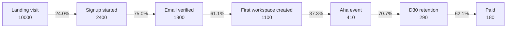

# Activation Funnel Expert

## Overview

A funnel is the single most useful diagnostic tool a growth or onboarding PM owns. It turns a fuzzy product story ("users drop off somewhere") into a numbered, actionable picture ("76% land, 41% start setup, 9% finish setup, 4% take the activation action -- the biggest drop is between start and finish setup at 32 percentage points").

This skill specifies funnel structures using **Dave McClure's AARRR** (Acquisition, Activation, Retention, Revenue, Referral) and its broader cousin **AAARRR** (which adds Awareness on the front), and analyzes them with a stdlib Python tool (`funnel_analyzer.py`). The tool ingests a JSON funnel definition (stages with counts), and outputs (a) stage-by-stage conversion and drop-off, (b) a Mermaid flowchart with conversion percentages on each arrow, (c) a bottleneck call-out for the largest absolute drop. It supports all six SHARED_OUTPUT_SCHEMA formats so the analysis travels into Jira, Linear, Confluence, Notion, or a PR.

The activation step is the centerpiece. Sean Ellis defined "activated user" as a user who has done the thing that, statistically, predicts retention. Slack's classic 2000-messages-per-team activation event, Facebook's "7 friends in 10 days", and Dropbox's "1 file in 1 folder on 1 device" are all activation definitions, not retention metrics. Pin the activation event before you optimize the funnel that leads to it.

### When to Use

- **New onboarding design** -- you are designing the user journey from signup to value and need to specify the funnel events.
- **Drop-off diagnosis** -- onboarding completion is flat but signups grow; where is the leak?
- **Activation metric definition** -- the team needs to pick the "aha" event that predicts long-term retention.
- **Cross-functional alignment** -- marketing optimizes acquisition, product optimizes activation, neither agrees on the funnel definition.
- **Quarterly business review** -- one canonical funnel chart drives the QBR conversation about growth.
- **A/B test design** -- a funnel makes the experiment's primary and counter-metric obvious.

### When NOT to Use

- For pre-product-market-fit discovery (use `discovery/brainstorm-ideas/`, `discovery/identify-assumptions/`; funnels presume a stable user journey).
- For pure top-of-funnel marketing-channel attribution (use marketing-side tools).
- For revenue-cohort retention analysis specifically (use the data-analytics domain; funnels capture single-flow conversion, cohorts capture time-based retention).
- When the team has not instrumented the events -- a funnel without telemetry is wishful thinking.

## Pirate Metrics framework (AARRR)

Dave McClure proposed Pirate Metrics in 2007 as a five-stage growth funnel:

| Stage | What it measures | Typical events |
|---|---|---|
| **Acquisition** | Users find you | Landing-page visit, ad click, organic search visit |
| **Activation** | First good experience | Signup, profile complete, "aha" event |
| **Retention** | They come back | D1, D7, D30 active; weekly active |
| **Revenue** | They pay | Trial-to-paid, upgrade, expansion |
| **Referral** | They tell others | Invite sent, invite accepted, share rate |

McClure's insight was that most teams obsess over Acquisition (the top) and Revenue (the bottom), while the leverage is usually in Activation and Retention. A 5-point improvement in activation flows through to retention, revenue, and referral; a 5-point improvement in acquisition often gets eaten by churn.

### AAARRR (Awareness-prefixed)

Some teams add **Awareness** at the front: how many people know your product exists at all? AAARRR is useful when the brand is new or the category is undefined; AARRR is fine when product-market fit is established.

| Stage | Question |
|---|---|
| **Awareness** | Do they know you exist? (impressions, mentions, branded search) |
| **Acquisition** | Do they visit you? (visits, signups-started) |
| **Activation** | Do they get value? (the aha event) |
| **Retention** | Do they come back? (D1, D7, D30) |
| **Revenue** | Do they pay? (trial-to-paid) |
| **Referral** | Do they bring friends? (invites, shares) |

## Defining activation: the "aha" event

Sean Ellis introduced the **activation-rate framework**: the activation event is the action that, statistically, separates users who retain from users who churn. Find it by:

1. Identify the cohort of users who are still active at D30 (or your retention horizon).
2. Look at what they did in their first session / first week that the churned cohort did not do.
3. The behavior with the highest correlation to D30 retention is the activation event candidate.

### Real activation events (publicly discussed)

| Product | Activation event |
|---|---|
| Slack | A team sends 2,000 messages |
| Facebook | A user adds 7 friends in 10 days |
| Dropbox | A user puts 1 file in 1 folder on 1 device |
| Airbnb (host) | A host books their first guest |
| Airbnb (guest) | A guest books their first trip |
| Notion | A user creates 3+ pages and invites 1+ collaborator |
| Spotify | A user listens to 25+ minutes in their first week |
| Duolingo | A user completes 1 lesson in 3 of their first 7 days |
| Twitter | A user follows 30+ accounts |
| HubSpot | A user adds 5 contacts and 2 deals |
| Pinterest | A user follows 5 boards and saves 1 pin |
| LinkedIn | A user adds 5 connections in their first week |
| Figma | A user creates a file and adds 2+ collaborators |
| Canva | A user creates a design and downloads or shares it |

The pattern: a **specific count + a specific time window + a specific action**. Vague "completed onboarding" is not an activation event -- it is an output. A good activation event is observable, instrumented, and predictive of long-term value.

## Funnel math

### Conversion rate

For each stage transition: `conversion[i] = users[i+1] / users[i]`

### Drop-off (absolute)

`drop[i] = users[i] - users[i+1]`

### Drop-off (rate)

`drop_rate[i] = 1 - conversion[i]`

### Cumulative conversion

`cumulative[i] = users[i] / users[0]`

The largest absolute drop is where the funnel leaks the most users. The largest *relative* drop (worst conversion rate) is where the stage is most broken. Both signals matter; this skill's tool surfaces both.

## Counter-metric pairing

Funnel optimization is famously easy to game. If you measure only conversion, you can boost it by lowering the bar at each stage:

- Drop email verification -> signup conversion goes up; fake-account problem goes up too.
- Auto-import data -> "activation" rate climbs; users feel nothing happened.
- Add a "skip" button -> setup completion climbs; D7 retention drops.

For every funnel stage, declare a **counter-metric** that must not degrade. The pair (conversion, counter-metric) is what gets reviewed -- not conversion alone.

| Funnel stage | Primary metric | Counter-metric |
|---|---|---|
| Acquisition | Signups / visitors | Quality signup rate (e.g., real-email %) |
| Activation | Activation rate | D7 retention of activated users |
| Retention | D30 retention | Engagement depth (events / active user) |
| Revenue | Trial-to-paid | First-month churn |
| Referral | Invite acceptance | Quality of referred user (do they activate?) |

## Leading vs lagging activation indicators

| Indicator | Timing | Use |
|---|---|---|
| **Leading** | Hours / days into use | Daily dashboard, on-call signal (e.g., "step 2 completion in first session") |
| **Activation** | First N days | The headline activation rate |
| **Lagging** | D30 retention of activated users | Quarterly truth check (is the activation event still predictive?) |

Leading indicators move first, so they are what the team optimizes. The activation rate is the headline. The lagging indicator audits whether the activation definition is still correct.

## Workflow

1. **Pick the framework.** AARRR for established product, AAARRR if the category is undefined.
2. **Define each stage as an event.** Each transition is `event A -> event B`. No vague stages.
3. **Pin the activation event.** Use Ellis's framework: find the behavior that separates retained from churned users.
4. **Instrument.** Telemetry must capture each stage event with a tenant / user / session id. Without instrumentation, the funnel is a guess.
5. **Pull stage counts** over a fixed window (week, month, or cohort). Note: a funnel for a cohort is more honest than a snapshot across cohorts.
6. **Run `funnel_analyzer.py`** to get conversion, drop-off, bottleneck, and the Mermaid diagram.
7. **Pair every stage with a counter-metric.** Document and review.
8. **Identify the bottleneck.** The largest absolute drop is usually where to invest. Use `prioritization-frameworks/` to rank fix-the-funnel projects.
9. **Wire the funnel into reporting.** Funnel deltas appear in weekly status (`status-update-generator/`) and quarterly review.

## Tools

| Tool | Purpose | Command |
|---|---|---|
| `funnel_analyzer.py` | Compute funnel conversions + drop-off + bottleneck; render in 6 formats | `python scripts/funnel_analyzer.py --input funnel.json --format markdown` |
| `funnel_analyzer.py --demo` | Inspect a worked SaaS activation funnel | `python scripts/funnel_analyzer.py --demo --format mermaid` |

## Troubleshooting

| Symptom | Likely Cause | Resolution |
|---|---|---|
| Funnel conversion looks great but D30 retention is flat | Activation event is too easy / not predictive of retention | Re-run Ellis's framework on the latest cohort; pick a harder + more predictive event |
| Stage counts do not add up; later stages exceed earlier ones | Multi-session or multi-tenant double-counting; events are not properly scoped | Constrain analysis to a single-cohort, single-user funnel; deduplicate by user_id; check event timestamps |
| Team optimizes acquisition; nothing improves downstream | The bottleneck is downstream, not at the top | Run the tool, look at absolute drop sizes, redirect investment to the largest drop stage |
| Activation rate jumps after a UX change but engagement drops | Counter-metric not paired; the funnel is being gamed | Add a counter-metric per stage; review the pair, not the conversion alone |
| Funnel looks different every week | Snapshot funnel across mixed cohorts | Switch to cohort-based funnel: pick a signup cohort, follow it through stages over the same N days |
| Funnel only covers the happy path | Edge cases and re-entries not modeled | List the 3-5 most common alternative paths; instrument them as parallel funnels or recovery loops |
| Stakeholders ignore the funnel chart | Chart has 12 stages and reads as a wall of numbers | Compress to 4-6 stages; the deeper drill-down lives in a dashboard, not the headline funnel |

## Success Criteria

- The funnel has 4-7 stages (5 is the sweet spot). Each stage is a specific event.
- The activation event is specific (count + window + action) and statistically predictive of retention.
- Every stage has a paired counter-metric documented.
- The analysis is cohort-based, not snapshot-based.
- The largest absolute drop is identified and assigned an owner.
- The funnel is reviewed weekly during build, monthly during steady-state.
- A new hire can name the activation event and the current funnel's biggest leak within their first week.

## Scope & Limitations

**In Scope:**
- Funnel definition (events, stages, transitions) using AARRR / AAARRR frameworks
- Conversion + drop-off math, bottleneck detection
- Mermaid flowchart rendering with conversion percentages on each transition
- Activation event selection guidance (Sean Ellis framework)
- Counter-metric pairing per stage
- Cohort vs snapshot funnel distinction
- All 6 SHARED_OUTPUT_SCHEMA formats for the analysis output

**Out of Scope:**
- Pulling raw event data from analytics tools -- input is JSON; use Amplitude/Mixpanel/PostHog/Looker to produce the JSON
- Statistical significance testing on funnel deltas (use `discovery/brainstorm-experiments/` for experiment design; data-analytics domain for stats)
- Cohort-retention analysis (a different kind of analysis -- see data-analytics)
- Channel-attribution modeling (marketing-side tools)
- Building the actual UX or A/B test (this skill specifies the funnel and the leak; engineering builds the fix)
- Forecasting (this is descriptive analysis, not predictive modeling)

**Important Caveats:**
- A funnel implies a linear flow. Real products have branches, re-entries, and recovery loops. Use the funnel as the headline; complement it with branched analysis when needed.
- Snapshot funnels mix cohorts and lie. Always specify the cohort window in the JSON input.
- Conversion improvements at top stages amplify downstream, so they look large in absolute users; this can mislead investment decisions away from genuinely-broken downstream stages. Look at *both* absolute and relative drop.
- An activation event that worked 12 months ago may no longer be predictive. Re-validate against the latest retention cohorts every 1-2 quarters.

## Integration Points

| Integration | Direction | Description |
|---|---|---|
| `north-star-metric/` | Pairs with | Activation rate is often the NSM or a top input metric in the NSM tree |
| `brainstorm-okrs/` | Feeds into | Funnel-stage targets become KRs (e.g., "improve activation from 28% to 36%") |
| `prioritization-frameworks/` | Feeds into | Fix-the-funnel projects ranked by RICE / weighted-score |
| `discovery/brainstorm-experiments/` | Pairs with | Each funnel leak suggests testable experiments to plug it |
| `discovery/identify-assumptions/` | Pairs with | "Users will complete step 3 if we shorten it" is an assumption to validate |
| `status-update-generator/` | Feeds into | Weekly funnel deltas appear in Highlights / Risks |
| `outcome-roadmap/` | Pairs with | Roadmap items justify themselves by which funnel stage they target |
| `cycle-time-analyzer/` | Pairs with | Cycle time to fix funnel leaks is part of flow analysis |
| `data-analytics/` (domain) | Pairs with | Telemetry instrumentation; cohort analysis; stat sig |

## Tool Reference

### funnel_analyzer.py

Analyzes a funnel from a JSON definition. Computes per-stage conversion + absolute and relative drop-off + bottleneck. Renders in 6 formats. Mermaid output uses `flowchart LR` with conversion % on each arrow.

| Flag | Type | Default | Description |
|---|---|---|---|
| `--input` | string | (required unless `--demo`) | Path to JSON funnel definition |
| `--demo` | flag | false | Use a built-in SaaS activation funnel |
| `--format` | choice | markdown | Output: json, markdown, mermaid, confluence, notion, linear |
| `--output` | string | stdout | Output file path |
| `--name` | string | (from input) | Override funnel name |
| `--cohort` | string | (from input) | Override cohort label |

### Input JSON shape

```json
{
  "name": "SaaS Free Trial Activation",
  "cohort": "Cohort: signups in week of 2026-05-04",
  "framework": "AARRR",
  "stages": [
    {"name": "Landing visit", "stage": "acquisition", "count": 10000, "counter_metric": "Bounce rate < 60%"},
    {"name": "Signup started", "stage": "acquisition", "count": 2400, "counter_metric": "Signup-to-real-email > 90%"},
    {"name": "Email verified", "stage": "acquisition", "count": 1800, "counter_metric": null},
    {"name": "First workspace created", "stage": "activation", "count": 1100, "counter_metric": null},
    {"name": "Aha event: 3 docs created + 1 collaborator", "stage": "activation", "count": 410, "counter_metric": "D7 retention of activated > 55%"},
    {"name": "D30 retention", "stage": "retention", "count": 290, "counter_metric": "Engagement events/day > 4"},
    {"name": "Paid", "stage": "revenue", "count": 180, "counter_metric": "First-month churn < 8%"}
  ]
}
```

### Mermaid output sample



The tool flags the largest absolute drop with a callout in the rendered output. In the demo above, the biggest leak in absolute users is at Landing -> Signup (7600 users), but the biggest *rate* drop is at First workspace -> Aha (37.3% conversion). Both get surfaced.

## References

- `references/pirate-metrics-deep-dive.md` -- McClure's AARRR + AAARRR, Andrew Chen funnel mechanics, Reforge growth model, NSM-funnel linkage
- `references/activation-aha-moment-patterns.md` -- Ellis's framework + 12 worked activation-event examples (Slack, FB, Dropbox, Airbnb, Notion, Spotify, Duolingo, Twitter, HubSpot, Pinterest, LinkedIn, Figma)
- `assets/funnel_design_canvas.md` -- Workshop canvas for defining the funnel
- `assets/activation_metric_worksheet.md` -- Worksheet for picking the activation event
- `assets/sample_funnel.json` -- A working JSON example matching the tool input
