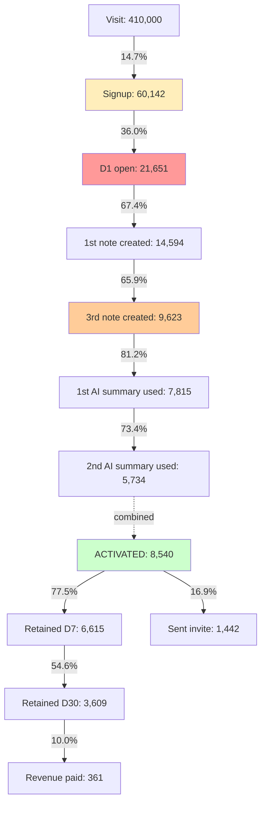

# Example: Cinder Notes — AARRR Funnel Diagnosis for a Freemium SaaS with Poor Day-7 Retention

> Real-world scenario showing how to apply this skill end-to-end.

## Context

Cinder Notes is a Series-A freemium note-taking + AI-summary product (32 employees, ~$2.1M ARR, ~14,000 paying customers + ~180,000 free users). Acquisition is growing fast (60K new free signups/month) but day-7 retention is dropping: from 18% six months ago to 11% today. The marketing team blames product; product blames marketing channel quality. The new growth PM (Maria Chen) needs to settle the argument with a single funnel chart that the whole leadership team can look at.

The activation-funnel skill is being applied to define the AARRR funnel, instrument and analyze it, identify the actual leak, and propose 3 ranked interventions. The output will go to the next executive review.

## Inputs

- 60,000 new free signups in the last 30 days
- Day-1 retention: 36%, Day-7 retention: 11%, Day-30 retention: 6%
- Trial-to-paid conversion: 4.2% (of activated users), 0.6% (of all signups)
- No formal activation event defined — team has been arguing about it for 6 months
- Marketing channels: organic search (45%), paid social (28%), referral (14%), other (13%)
- Tools: Mixpanel for events, Stripe for revenue, Segment for routing
- Constraint: leadership wants a single-page diagnostic, not a 40-slide deck

## Applying the skill

1. **Defined the activation event FIRST.** Most diagnoses fail because they optimize the funnel without pinning the activation moment. Maria pulled D30-retained vs. D30-churned cohorts, regressed first-session behaviors, and found the predictive event.
2. **Built the funnel using AARRR.** Did NOT add Awareness on the front (AAARRR) — Cinder has clear product-market fit and the marketing team already owns Awareness as a separate metric.
3. **Used absolute drop, not just percentage.** A 50% drop on 1,000 users is 500 lost. A 10% drop on 60,000 is 6,000 lost. Conversion rates alone misleads.
4. **Identified the BOTTLENECK with the largest absolute drop.** That is the leak that matters; everything else is noise.
5. **Compared channel cohorts to test the marketing-quality hypothesis.** If the leak is channel-specific, the marketing team is right. If it is uniform across channels, the product team is right.
6. **Generated 3 ranked recommendations with expected lift.** Not a list of 14 ideas. Three. Each ranked by lift x feasibility.

## The artifact

```
================================================================
  CINDER NOTES — ACTIVATION FUNNEL DIAGNOSIS
  Period: 2026-04-22 to 2026-05-22 (30 days)
  Cohort: 60,142 new free signups
  Owner: Maria Chen (Growth PM)
  Date: 2026-05-22
================================================================


PART 1 — DEFINING THE ACTIVATION EVENT

Method: Logistic regression of first-session behaviors against
D30 retained / churned.

Top 5 behaviors correlated with D30 retention:
  Behavior                                       Corr w/ D30
  ----------------------------------------       -----------
  Created 3+ notes in first 7 days                0.71
  Used AI summary 2+ times in first 7 days        0.64
  Invited 1+ collaborator in first 7 days         0.58
  Created at least 1 note from a template         0.41
  Connected calendar integration                  0.33

Activation event chosen:
  "User creates 3+ notes AND uses AI summary 2+ times
   in their first 7 days."

Rationale: combining notes-creation (storage commitment)
with AI-summary use (value extraction) is more predictive
than either alone (combined corr 0.79). Matches the
established pattern of "specific count + specific window +
specific action."

Current activation rate: 14.2% of signups
Industry-comparable (Notion, Bear, Obsidian): est. 18-22%
Target: 22% by Q3 end


PART 2 — THE AARRR FUNNEL (CURRENT STATE)

Stage              Count    Conv from prev    Conv from top
------------------- -------- ---------------- --------------
Acquisition: visit  410,000        -                 -
Acquisition: signup  60,142     14.7%             14.7%
Activation: D1 open  21,651     36.0%              5.3%
Activation: 1st note 14,594     67.4%              3.6%
Activation: 3rd note  9,623     65.9%              2.3%
Activation: 1st AI    7,815     81.2%              1.9%
Activation: 2nd AI    5,734     73.4%              1.4%
ACTIVATED (full)      8,540     14.2% of signups

(Activation full count differs from sequential because
some users hit 3+ notes and 2+ AI but in different
orders; the activation event is the AND of both
conditions across the 7-day window.)

Retention D7         6,615     11.0% of signups
Retention D30        3,609      6.0% of signups
Revenue (free->paid)   361      0.6% of signups (4.2% of
                                activated)
Referral (sent invite) 1,442    2.4% of signups (16.9% of
                                activated)


PART 3 — FUNNEL DIAGRAM (MERMAID)




PART 4 — BOTTLENECK ANALYSIS (BY ABSOLUTE DROP)

  Step                                Drop (people)  Drop (%pts)
  --------------------------------    -------------  -----------
  Signup -> D1 open                       38,491         64.0
  D1 open -> 1st note                      7,057         32.6
  1st note -> 3rd note                     4,971         34.1
  3rd note -> 1st AI                       1,808         18.8
  1st AI -> 2nd AI                         2,081         26.6
  Activated -> D7 retention                1,925         22.5
  D7 retained -> D30 retained              3,006         45.4
  D30 retained -> Paid                     3,248         90.0

THE BOTTLENECK: Signup -> D1 open. 38,491 users sign up
and never come back even once. That single step loses 64%
of all signups — more people than the entire rest of the
funnel combined.

Secondary bottleneck: D7 -> D30 retention. Losing 45% of
users who made it to day 7 means activated users aren't
sticking — symptom of a deeper engagement issue, not an
onboarding issue.


PART 5 — CHANNEL-LEVEL ANALYSIS (TESTS THE MARKETING-VS-
PRODUCT ARGUMENT)

Day-1 open rate by acquisition channel:

  Channel            Signups   D1 open   Rate
  -----------------  -------   -------   ----
  Organic search      27,064    11,468   42.4%
  Paid social         16,840     4,800   28.5%
  Referral             8,420     4,420   52.5%
  Other (direct/etc)   7,818     2,963   37.9%
  ALL                 60,142    21,651   36.0%

Activation rate (full) by channel:

  Channel            Activation rate
  -----------------  ---------------
  Organic search       18.6%
  Paid social           7.2%
  Referral             24.3%
  Other                14.4%
  ALL                  14.2%

D7 retention by channel (of activated users):

  Channel            D7 retention of activated
  -----------------  --------------------------
  Organic search        78.0%
  Paid social           69.4%
  Referral              82.1%
  Other                 76.8%
  ALL                   77.5%

INTERPRETATION:
  - Paid social channel is the worst at every stage.
    D1 open 28.5% vs. 42% for organic; activation 7.2%
    vs. 18.6% for organic.
  - Once paid-social users activate, they retain at 69%
    — not catastrophic, but lower than other channels.
  - The marketing-quality hypothesis is PARTIALLY correct:
    paid social brings lower-intent users. Removing paid
    social entirely would lift overall activation rate
    from 14.2% to 17.5% (math: weighted avg without paid).
  - BUT: even organic search activates at only 18.6%,
    far from the 22% target.
  - Both teams have a case. Product needs to lift activation
    among ALL channels. Marketing needs to fix the paid
    social channel mix.


PART 6 — D7->D30 LEAK (THE OTHER LEAK)

D7 retained users: 6,615
D30 retained users: 3,609 (45% drop)

Of users who hit activation AND retained D7, the D30 leak
is roughly equal across channels — this is a product
engagement issue, not channel quality.

Behavioral pattern of D7-retained-then-churned users:
  - 71% created notes only in week 1, none in week 2
  - 60% never used AI summary after first 7 days
  - 48% never invited a collaborator (vs. 22% of D30-
    retained)

The pattern: users do the activation behaviors in week 1
to satisfy onboarding, then stop. Activation is not the
same as engagement.


PART 7 — RANKED RECOMMENDATIONS

REC 1 — Fix the Signup -> D1 open leak (biggest bottleneck)

  Problem: 38,491 of 60,142 signups never return.
  Hypothesis: weak immediate-value moment on signup.

  Intervention: rebuild onboarding to deliver an AI summary
  on a sample note within the first 60 seconds — before
  the user leaves the signup session. The "first AI summary"
  step becomes part of the signup session, not a separate
  visit.

  Expected lift: D1 open from 36% -> 50-55% (based on
  competitor benchmarks).
  Flow-through: ~6,000-9,000 additional activations/month
  at current scale.
  Effort: 2 engineer-sprints. Reversible via flag.

REC 2 — Stop or fix paid social channel

  Problem: paid social channel is half as good at every
  step. The team is paying CAC for users who never
  activate.
  Hypothesis: paid social brings curious-but-not-intent
  signups.

  Intervention: re-audit the paid social creative + landing
  page. Test 3 ad variants targeting higher-intent keywords.
  If after 60 days the channel still activates below 15%,
  cut the budget.

  Expected lift: activation rate moves from 14.2% to
  ~16% if paid social activation hits 15%.
  Effort: marketing-led; product builds dedicated paid-
  social landing page (1 sprint).

REC 3 — Address the D7->D30 leak with a week-2 re-engagement
        moment

  Problem: 45% of D7-retained users churn by D30 because
  week 2 has no compelling moment.
  Hypothesis: activation behaviors are not habitual; users
  satisfy onboarding then drift.

  Intervention: at day 8, surface a "your week in notes"
  AI-generated summary email — showing the user what they
  captured + the most useful AI summary from week 1.

  Expected lift: D7->D30 retention from 54.6% -> 65%.
  Flow-through: 700-900 additional D30 retained per month.
  Effort: 1 sprint for the AI email pipeline; integrates
  with existing AI summary infrastructure.


PART 8 — SUMMARY FOR LEADERSHIP

  The current funnel diagnosis:
    1. Acquisition is fine (volume growing 12% MoM).
    2. The biggest leak is Signup -> D1 open (64% drop).
       This is a product onboarding problem.
    3. Paid social channel underperforms at every stage.
       This is a marketing channel-mix problem.
    4. Activated users retain at 77.5% to D7 but only 54.6%
       to D30. This is a product engagement (week-2)
       problem.

  Three ranked bets:
    REC 1: Fix the Signup -> D1 open leak (PRODUCT)
    REC 2: Fix or cut paid social (MARKETING)
    REC 3: Add a week-2 AI re-engagement (PRODUCT)

  Both teams have work. Both teams have ownership.
  The diagnosis is not "whose fault" — it's "which leak
  matters most by people lost."


PART 9 — METRIC SCOREBOARD (NEXT 90 DAYS)

  Metric                    Baseline   Target
  ------------------------- ---------- --------
  D1 open                       36.0%    50.0%
  Activation rate (full)        14.2%    22.0%
  Paid social activation         7.2%    15.0%
  D7 retention (of signup)      11.0%    16.0%
  D30 retention (of signup)      6.0%     9.0%
  Free->paid (of activated)      4.2%     5.0%

  Pulled weekly. Reviewed in the Tuesday growth standup.


PART 10 — WHAT THE DIAGNOSIS DID NOT CONCLUDE

  - Whether AI summary is the right activation event
    forever. We will re-derive in 6 months.
  - Whether to add a paid tier feature for activated free
    users. Pricing question; out of scope.
  - Whether free signup itself is the right top of funnel
    or if we should require email confirmation. Open
    question; tracked for Q4.
  - Whether referral mechanics should be amplified. They
    work (52.5% D1 open) but volume is bounded by users'
    own networks. Tracked for Q4.

  Each of these is parked, not forgotten.
```

## Why this works

- **Activation event defined BEFORE funnel optimization.** Without a pinned activation event, "activation rate" is a guess. The logistic regression against D30 retention is what makes the activation event credible to leadership.
- **Multi-event activation is fine.** Cinder's activation is "3+ notes AND 2+ AI summaries in 7 days" — both behaviors together. Less-experienced PMs pick a single event because it's easier to communicate; the multi-event definition is what matched the data.
- **Used absolute drops, not just rates.** The Signup -> D1 open step has a 64% drop rate AND loses 38,491 people. The D30 -> Paid step has a 90% drop rate but only loses 3,248 people. A weaker analysis would point at the 90% rate as the worst. Absolute drop is correct.
- **Channel cut tested the political argument.** The marketing-vs-product debate became data, not opinion. Both teams have legitimate points. Both teams have work.
- **Three ranked recommendations, not fourteen ideas.** A long list of "things we could do" is the wrong output. Three bets, each with expected lift and effort, is the right format for an executive review.
- **D7 -> D30 leak surfaced as a separate problem.** Most funnel diagnostics stop at activation. The week-2 engagement leak is a different problem with a different intervention (week-2 AI re-engagement). Separating them is what makes REC 3 ship-able.
- **Parked questions named.** "Whether free signup itself is right" is a real question but not for this diagnosis. Naming it as parked prevents scope creep.
- **Activation event will be re-derived.** Activation events are not eternal. The funnel will be re-instrumented as the product evolves. Naming this honestly is the discipline.

## What's next

- REC 1 (fix Signup -> D1 open) gets a full PRD via [`../create-prd/`](../create-prd/) before commit.
- REC 1 also gets an assumption-map via [`../../discovery/identify-assumptions/`](../../discovery/identify-assumptions/) — the "60-second AI summary in signup" hypothesis must be tested.
- REC 2 (paid social channel fix) is marketing-led; PM tracks the landing-page experiment via [`../../discovery/brainstorm-experiments/`](../../discovery/brainstorm-experiments/).
- REC 3 (week-2 re-engagement) is a feature; PRD via [`../create-prd/`](../create-prd/) and ai-feature-specific framing via [`../ai-feature-prd/`](../ai-feature-prd/).
- The metric scoreboard plugs into the weekly status update via [`../status-update-generator/`](../status-update-generator/).
- North-star metric tree connection: see [`../north-star-metric/`](../north-star-metric/) for how activation rate feeds the company NSM.
- Pre-launch pre-mortem for REC 1 uses [`../../discovery/pre-mortem/`](../../discovery/pre-mortem/).
