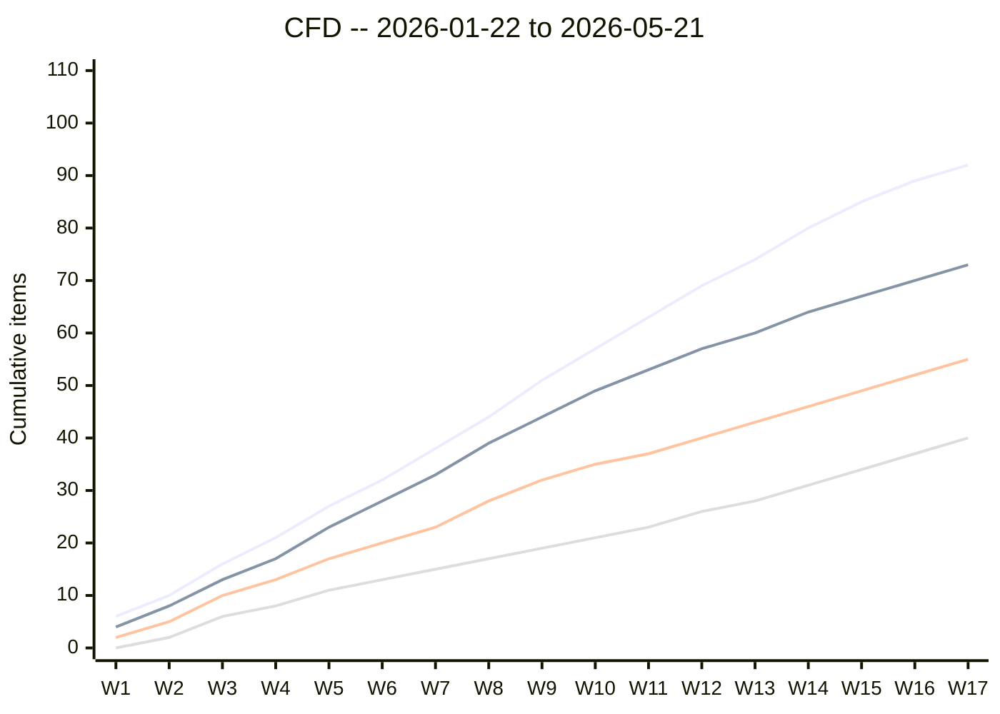
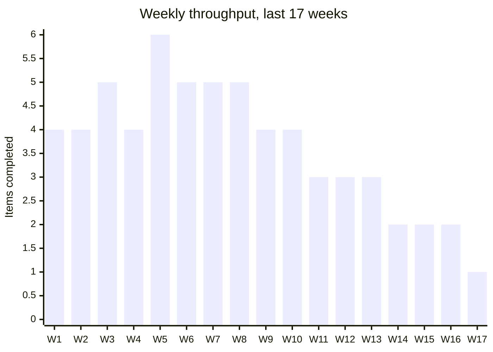

# Example: Flow Analysis for Wayfinder's Onboarding Squad

> Real-world scenario showing how to apply flow metrics to diagnose a 6-person team's bottleneck.

## Context

Wayfinder is a Series-B B2B project-management SaaS. The Onboarding & Activation squad (6 people: 1 PM, 1 EM, 3 engineers, 1 designer) has shipped erratic sprints for the last quarter. Velocity (story points) ranges from 18 to 34 per sprint with no obvious cause. The EM (N. Gupta) doesn't trust the story-point signal and asked the PM (Sam) to run a flow-metrics analysis.

Sam exports the last 3 months of Linear issue history (Jan 22 to May 21, 2026) -- 82 completed items, 14 in flight, 6 dropped. The analysis will be presented at the next sprint retro.

## Inputs

- Linear export `issues.json` -- 102 issues, full status-transition history
- The `flow_metrics.py` tool
- Team's WIP limit policy: none enforced (this is part of the diagnosis)
- Stated definition of "started": item moves into "In Progress"
- Stated definition of "done": item closed in Linear

## Applying the skill

1. **Ran the four core metrics** (lead time, cycle time, throughput, WIP). Cycle time p50 = 4.2 days, p85 = 11.8 days, p95 = 17.1 days. The p95/p50 ratio of ~4x signaled high variability.
2. **Generated the Cumulative Flow Diagram** (`flow_metrics.py --format mermaid --cfd`). The CFD showed a widening band in "In Review" starting in week 6 -- the classic visual signature of a review bottleneck.
3. **Computed Little's Law sanity check.** Average WIP / average throughput = 11.4 / 2.6 = 4.4 days expected cycle time -- close to the observed median, validating the data.
4. **Aged WIP report** flagged 5 items currently older than 11.8 days (the p85). 4 of them were stuck in "In Review" with the same reviewer.
5. **Diagnosed the bottleneck** as a single-reviewer dependency. Two of the three engineers were senior; one was a recent join. The senior engineers were the only approvers in the team's GitHub branch protection.
6. **Recommended actions** for the retro: distribute review load, lower WIP limit to 4, age-WIP review at every daily standup.

Key decision quoted from the retro: *"Story-point velocity didn't move because we always estimated the same. Throughput dropped from 3.2/wk to 1.8/wk -- that's a 44% drop the velocity number was hiding."*

## The artifact

````markdown
# Wayfinder Onboarding Squad -- Flow Metrics Analysis

**PM:** Sam (PM)
**Period:** 2026-01-22 to 2026-05-21 (17 weeks, 8 two-week sprints)
**Items analyzed:** 102 (82 closed, 14 in flight, 6 dropped/cancelled)
**Tool:** `flow_metrics.py` v1.0.0

## Headline numbers

| Metric | Last 4 weeks | Prior 4 weeks | Trend |
|---|---|---|---|
| Throughput (items/week) | 1.8 | 3.2 | DOWN 44% |
| Cycle time p50 (days) | 6.1 | 3.8 | UP 60% |
| Cycle time p85 (days) | 14.4 | 9.2 | UP 57% |
| Cycle time p95 (days) | 21.0 | 12.5 | UP 68% |
| Average WIP | 11.4 | 8.2 | UP 39% |
| Aging WIP items (> p85) | 5 | 1 | UP |
| Story-point velocity | 26 | 24 | flat (misleading) |

**Headline read:** throughput is down 44% and cycle time variability is up. Story-point velocity is flat because the team estimates the same stories the same way -- the velocity signal is hiding a real delivery slowdown.

## Cumulative Flow Diagram



Series (top to bottom): Backlog, In Progress, In Review, Done.

**Read the CFD:** in weeks 1-6 the In Review band is thin and flat -- items pass through review quickly. Starting in week 7 the In Review band widens steadily. The slope of the Done line drops in weeks 11-17 -- delivery slowed.

## Little's Law sanity check

```
Average cycle time = Average WIP / Average throughput
                   = 11.4 / 2.6
                   = 4.4 days expected

Observed median cycle time = 4.2 days
```

The data passes the sanity check (within rounding). The model is honest.

## Aging WIP -- items in flight > p85 cycle time (11.8 days)

| Issue | Age (days) | State | Assignee | Reviewer | Notes |
|---|---|---|---|---|---|
| WAY-198 | 22 | In Review | Sara (eng) | Marcus (senior) | Pending review since week 13 |
| WAY-186 | 19 | In Review | Lin (eng) | Marcus (senior) | Reviewer OOO 5 days |
| WAY-204 | 16 | In Review | Sara (eng) | Marcus (senior) | Approved but not merged |
| WAY-211 | 14 | In Review | Lin (eng) | Marcus (senior) | First review round |
| WAY-189 | 13 | In Progress | Daria (eng, new) | -- | First story for a new joiner |

**Pattern visible:** 4 of 5 aging items are waiting on the same reviewer (Marcus). The fifth is a new-joiner ramp issue.

## Throughput distribution per state

| State | Median time in state (hrs) | p85 (hrs) | Where time goes |
|---|---|---|---|
| Backlog -> In Progress | n/a | n/a | (not counted in cycle time) |
| In Progress | 8.5 | 28.0 | Active engineering |
| In Review | 18.0 (was 4.5) | 96.0 (was 18.0) | **Bottleneck** |
| In Review -> Done (merge wait) | 1.5 | 12.0 | Wait for CI + merge slot |

Time in "In Review" quadrupled vs the prior 4 weeks.

## Diagnosis

The team has a **single-reviewer dependency**. Marcus is the only senior engineer empowered (by branch protection) to approve PRs in 3 of the 5 services the squad touches. Two factors compounded:

1. Daria (new joiner) ramping -- her PRs need more review iterations.
2. Marcus took 5 days OOO mid-period; queue depth doubled.

The team has no WIP limit. New items kept starting; aging items kept waiting. By week 12 the team had 14 items in flight with capacity for ~8.

Story-point velocity does not surface this because:

- The team estimates the same kind of story the same way every sprint.
- A finished story counts the same as a stuck-in-review story for velocity computation; throughput counts only delivered.

## Recommendations (for retro discussion)

| Action | Owner | Mechanism | Why |
|---|---|---|---|
| Set WIP limit at 4 active items in "In Progress" | EM | Linear board policy | Force pull over push (Vacanti) |
| Set WIP limit at 3 in "In Review" | EM | Linear board policy | Make the queue visible |
| Add Lin and Sara to the approver list for 2 of 3 services | EM | Branch protection | Distribute review load |
| Aging-WIP review at daily standup (anything > p85) | Team | 2 min agenda item | Visibility forces action |
| Track throughput, not velocity, in retros | PM | Switch retro metric | Throughput correlates with delivery; velocity does not, given our pattern |
| Daria pair-reviews with Lin first, Marcus second | EM | Process | Shorten the path; coaching by design |

## Forecast under recommendations

If WIP drops from 11.4 to 6 and average throughput recovers to 2.6/week, Little's Law predicts:

```
Cycle time = WIP / Throughput = 6 / 2.6 = 2.3 days
```

A median cycle time of 2-3 days is the target. Reassess in 4 weeks.

## What we are NOT recommending

- **Hiring another senior reviewer.** The team already has the capacity; the constraint is the policy that funnels reviews to one person.
- **Splitting Daria off to a coaching track.** New-joiner ramp is normal; the slowdown was not Daria-caused. (The Allspaw-style framing: blame the system, not the person.)
- **Increasing story-point estimation rigor.** Velocity is not the problem; it is the wrong metric for this team's pattern.

## Data quality notes

- 6 items in the period were dropped/cancelled. Excluded from cycle time but counted in throughput as zero.
- "In Review" status was added 2026-02-12; data before that imputes In Review from PR-creation timestamp in GitHub.
- One outlier (WAY-167, 47-day cycle time, was the original onboarding-wizard story) excluded from p95 to avoid skew.

## Mermaid: Throughput trend



The break is unambiguous at week 11.

## Suggested retro agenda (15 min on this topic)

1. (3 min) Walk the CFD and the aging-WIP table.
2. (3 min) Surface the single-reviewer dependency.
3. (5 min) Agree on WIP limits and approver-list change.
4. (2 min) Decide on tracking metric for next retro (throughput, not velocity).
5. (2 min) Schedule re-measurement in 4 weeks.
````

## Why this works

- Throughput surfaces the real slowdown (44% drop) that velocity hides.
- The CFD makes the bottleneck visible -- a widening band in one state is the classic Vacanti signature.
- Little's Law sanity check confirms the data is honest before any recommendations are made.
- Aging WIP names specific items and reveals the single-reviewer pattern, which makes the recommendation actionable.
- The recommendation is a WIP limit + approver-list change, both reversible. No hiring, no reorg -- the cheapest interventions first.

## What's next

- Pair with [../../sprint-retrospective/](../../sprint-retrospective/) at the next retro to drive adoption of the recommendations.
- Use [../dependency-map/](../dependency-map/) if the approver dependency turns out to span multiple teams.
- Use [../../scrum-master/](../../scrum-master/) for capacity calculation given the new WIP limit.
- Re-run this analysis in 4 weeks to verify the lift; archive in `flow-history/`.
- Surface the metric switch (throughput, not velocity) via [../status-update-generator/](../status-update-generator/) to set exec expectations.
