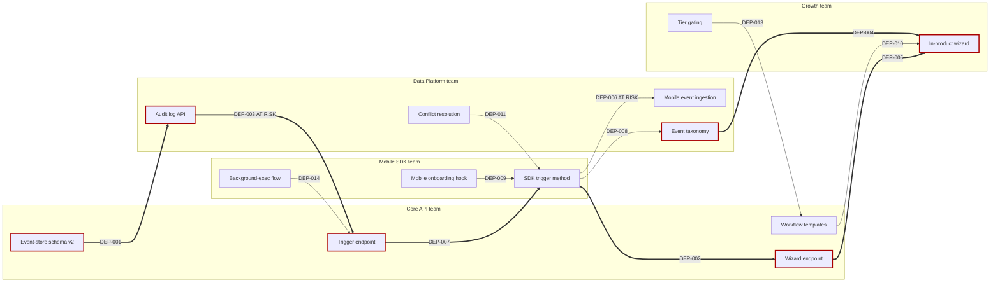

# Example: Q4 Launch Dependency Map at Helix Platform

> Real-world scenario showing how to map cross-team dependencies for a multi-team launch.

## Context

Helix Platform is a Series-C developer-tools SaaS with four product teams: Core API, Mobile SDK, Data Platform, and Growth. The Q4 launch is a new "Workflow Automation" feature that requires contributions from all four teams. The Program Manager (Ravi Patel) needs to map dependencies, identify the critical path, and produce a weekly cross-team sync agenda.

Last quarter's launch slipped by 5 weeks because a small dependency between Data Platform and Mobile SDK was missed until week 6. Ravi is determined this Q4 launch will not repeat that pattern.

## Inputs

- 4 teams, each with a tech lead + PM
- 14 known dependencies surfaced in the kickoff workshop
- Target launch: 2026-11-04 (24 weeks from kickoff at 2026-05-22)
- Each team owns a piece: Core API (orchestration engine), Mobile SDK (workflow triggers from mobile), Data Platform (event store + analytics), Growth (in-product onboarding + activation)
- Tool: `dependency_graph.py`

## Applying the skill

1. **Captured all dependencies** in `deps.json` (id, from_team, to_team, description, needed_by, expected_delivery, status).
2. **Computed slack** for each. 4 dependencies had slack <= 7 days; 2 already had negative slack.
3. **Identified the critical path** -- the longest chain through the program -- as 6 dependencies running through Core API -> Data Platform -> Growth.
4. **Generated a Mermaid `graph LR`** to make the critical path visually obvious.
5. **Wrote the weekly cross-team sync agenda** so the meeting focuses on critical-path items first.
6. **Flagged a Conway's Law risk**: Mobile SDK and Data Platform have 4 dependencies between them this quarter, and 5 last quarter. The pattern suggests a structural problem.

Key decision quoted: *"We are not adding a fifth team to absorb the Conway pattern. We are accepting it and putting the two PMs in a standing 30-min Wednesday sync. Org change comes later."*

## The artifact

````markdown
# Q4 Launch Dependency Map -- Helix Platform "Workflow Automation"

**Program Manager:** Ravi Patel
**Launch target:** 2026-11-04
**As of:** 2026-05-22 (week 0 of 24)
**Teams:** Core API, Mobile SDK, Data Platform, Growth
**Source of truth:** `deps.json` in the program Confluence space

## Dependency table

| ID | From team (needs) | To team (owes) | Description | Needed by | Expected | Slack (d) | Status | Crit |
|---|---|---|---|---|---|---|---|---|
| DEP-001 | Core API | Data Platform | Event-store v2 schema with workflow_id column | 2026-06-30 | 2026-06-15 | +15 | in_progress | critical |
| DEP-002 | Mobile SDK | Core API | Public workflow-trigger endpoint | 2026-07-15 | 2026-07-10 | +5 | in_progress | critical |
| DEP-003 | Data Platform | Core API | Workflow-step audit log API | 2026-07-20 | 2026-08-05 | -16 | at_risk | critical |
| DEP-004 | Growth | Data Platform | Activation event taxonomy with workflow events | 2026-08-15 | 2026-08-10 | +5 | not_started | high |
| DEP-005 | Growth | Core API | In-product wizard endpoint | 2026-09-01 | 2026-08-25 | +7 | not_started | high |
| DEP-006 | Mobile SDK | Data Platform | Mobile-event ingestion path | 2026-08-20 | 2026-09-05 | -16 | at_risk | high |
| DEP-007 | Core API | Mobile SDK | Workflow-trigger SDK method | 2026-08-01 | 2026-07-28 | +4 | in_progress | critical |
| DEP-008 | Data Platform | Mobile SDK | Mobile event schema sign-off | 2026-07-25 | 2026-07-20 | +5 | in_progress | high |
| DEP-009 | Growth | Mobile SDK | Mobile onboarding hook | 2026-09-15 | 2026-09-10 | +5 | not_started | medium |
| DEP-010 | Core API | Growth | UTM-tracked workflow templates | 2026-10-01 | 2026-09-25 | +6 | not_started | medium |
| DEP-011 | Mobile SDK | Data Platform | Conflict resolution on mobile sync | 2026-10-01 | 2026-10-08 | -7 | not_started | medium |
| DEP-012 | Data Platform | Core API | Workflow-execution metrics export | 2026-10-10 | 2026-10-05 | +5 | not_started | medium |
| DEP-013 | Growth | Core API | Customer-tier gating for workflow features | 2026-10-15 | 2026-10-10 | +5 | not_started | low |
| DEP-014 | Mobile SDK | Core API | iOS background-execution permission flow | 2026-10-20 | 2026-10-18 | +2 | not_started | low |

## Critical path (zero or negative slack chain)

Determined by `dependency_graph.py --critical-path`:

```
[Start]
   |
DEP-001 (Core API needs Event-store v2 schema from Data Platform)
   |
DEP-003 (Data Platform needs Workflow-step audit log API from Core API)  <-- AT RISK, -16 days
   |
DEP-007 (Core API needs Workflow-trigger SDK method from Mobile SDK; SDK depends on the schema)
   |
DEP-002 (Mobile SDK needs Workflow-trigger endpoint from Core API)
   |
DEP-004 (Growth needs Activation event taxonomy from Data Platform)
   |
DEP-005 (Growth needs In-product wizard endpoint from Core API)
   |
[Launch 2026-11-04]
```

Total length: 162 days from kickoff. The launch date has 6 days of buffer if every critical link delivers on the latest expected date.

**Single biggest risk:** DEP-003 has -16 days of slack. If unresolved by 2026-06-15, the launch slips.

## Mermaid graph (critical path bolded)



## Risk-ordered blocker list (top 5)

| # | ID | Risk | Owner pair | Action this week |
|---|---|---|---|---|
| 1 | DEP-003 | AT RISK (-16 days) | Data Platform <- Core API | Re-scope or descope; escalate to VP Eng if no plan by Friday |
| 2 | DEP-006 | AT RISK (-16 days) | Mobile SDK <- Data Platform | Mobile event ingestion needs a smaller v1; PM pair to split |
| 3 | DEP-011 | Negative slack (-7) | Mobile SDK <- Data Platform | Plan a 2-week buffer or defer to v1.1 |
| 4 | DEP-002 | Tight slack (+5), critical | Mobile SDK <- Core API | Core API commits to weekly status |
| 5 | DEP-004 | Critical, not started | Growth <- Data Platform | Schedule kickoff between PMs by Wednesday |

## Conway's Law signal

Mobile SDK and Data Platform have **4 of the 14** dependencies between them in this program, and had **5 of 11** dependencies between them last quarter. The pattern is structural.

Three responses considered:

1. **Reorg.** Merge Mobile-events ownership into one team. Cost: 6-12 month transition. Not chosen this quarter.
2. **Pair PMs.** Standing 30-min Wednesday sync between Mobile SDK PM (Lena) and Data Platform PM (Felix). Chosen.
3. **Accept and instrument.** Track repeated dependencies; if pattern persists Q1 2027, escalate the reorg conversation.

## Weekly cross-team sync agenda

Cadence: Wednesday 10:00-10:30. Driver: Ravi (Program Manager). 4 team PMs attend.

| Min | Topic | Owner |
|---|---|---|
| 0-2 | Critical path status: any change? | Ravi |
| 2-10 | Top 3 at-risk dependencies (deep dive on most-changed) | Owning team PM |
| 10-15 | Newly surfaced dependencies (last 7 days) | All |
| 15-22 | Decisions needed this week | Ravi |
| 22-28 | Mobile SDK + Data Platform pair update (Conway dependency) | Lena + Felix |
| 28-30 | What to communicate to teams | All |

## Status of all dependencies

```
done            : 0 (0%)
in_progress     : 4 (29%)
not_started     : 8 (57%)
at_risk         : 2 (14%)
blocked         : 0 (0%)
```

Acceptable distribution at week 0. By week 8, target: at_risk + blocked <= 1, done >= 4.

## Escalation thresholds

| Trigger | Escalate to | Within |
|---|---|---|
| Critical-path dependency turns at_risk | VP Eng | Same day |
| Slack on any critical dep drops below -10 days | VP Eng + sponsor | Same day |
| Same dep slips twice | Steering committee | Next steering review |
| Two critical deps slip in same week | CEO awareness | 48 hours |

## Forecast

If at-risk deps (DEP-003 and DEP-006) are not de-risked by 2026-06-30, the 2026-11-04 launch date is at material risk. Currently, descope of DEP-003 is the cheapest mitigation (a smaller audit log API is acceptable for v1).

## Next checkpoint

Re-run `dependency_graph.py` at the end of week 2 (2026-06-05). Surface delta from this baseline.
````

## Why this works

- The critical path is computed, not guessed -- one chain of zero/negative slack threading 6 dependencies.
- AT RISK items with -16 days of slack are surfaced at the top of the blocker list, not buried in the table.
- Conway's Law signal is named explicitly and addressed with a low-cost intervention (PM pairing), not a reorg.
- The weekly sync agenda starts with critical path and ends with what to communicate -- structured to drive movement, not just status.
- Escalation thresholds are pre-agreed, so no "should we escalate?" debate when a slip happens.

## What's next

- Pair with [../../program-manager/](../../program-manager/) for the broader program operating cadence.
- Use [../daci-framework/](../daci-framework/) to resolve who decides on the DEP-003 descope.
- Feed status into [../status-update-generator/](../status-update-generator/) for the weekly exec update.
- Use [../../discovery/pre-mortem/](../../discovery/pre-mortem/) on the launch itself if at-risk deps don't clear by week 8.
- Capture decisions in [../summarize-meeting/](../summarize-meeting/) -- every Wednesday sync produces an action-item log.
