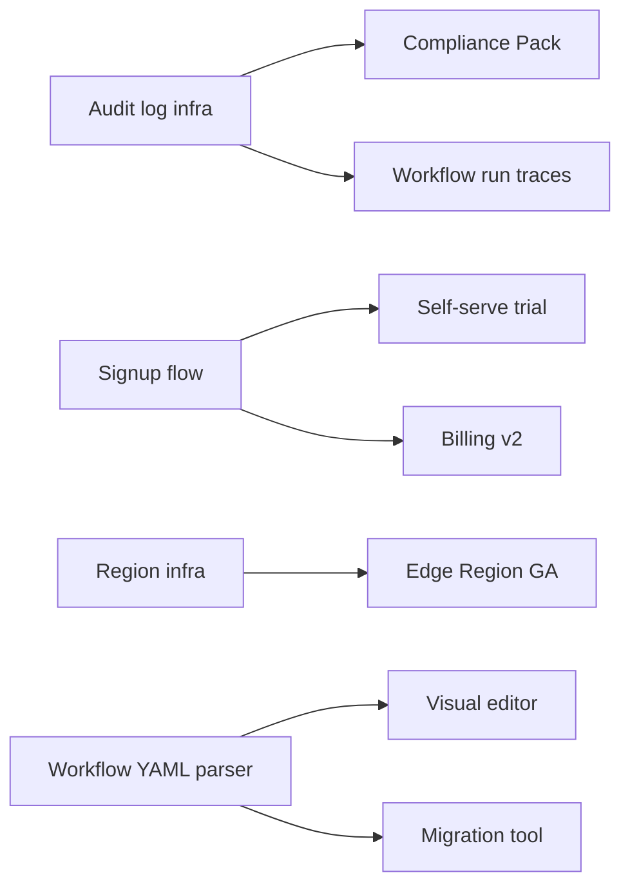

# Example: Pylon's H2 Roadmap, Presented Three Ways

> Real-world scenario showing how to apply this skill end-to-end.

## Context

Pylon is a devops/infra startup, Series A, 30 people. The H2 2026 roadmap has been finalized. The same five themes need to land with three very different audiences: the board (story-shaped, outcome-led), customers (benefit-led, demo-able), and the engineering team (sequenced, scope-bounded, with dependencies).

The PM (Sasha) made a previous attempt where the engineering team got the board deck and pushed back hard ("this is not a roadmap, this is a wish list"). Customers got the engineering Gantt and bounced ("when can I use it?"). Sasha rebuilt the artifacts with audience-specific language and structure.

## Inputs

- H2 2026 themes (locked at quarterly planning): Tier-1 Observability, Workflow Engine v2, Self-Serve Trial, Compliance Pack, Edge Region GA
- Three audiences: board (5 people), customers (~120 active accounts), engineering (22 people)
- Brand voice: confident, technical, no hype
- Constraint: no committed dates outside engineering view

## Applying the skill

1. **Start from one canonical roadmap.** A single source-of-truth doc lists the five themes with desired outcomes. Every variant pulls from this.
2. **Re-frame for the audience.** Board sees outcomes + bets. Customers see benefits + demoable milestones. Engineering sees sequenced work with dependencies and risk.
3. **Strip dates for the wrong audiences.** Engineering gets quarters. Customers get "later this year" and "early next year." Board gets H2 and 2027.
4. **Use the same color/theme labels** across all three so a customer hearing the CEO speak can map a slide to a quote.

## The artifact

---

### Variant 1: Executive Board Deck

**Audience:** Board, 5 people
**Format:** 10-slide PDF excerpt below in markdown
**Tone:** Strategic, outcome-led, story-shaped

---

#### Slide: Pylon H2 2026 -- the three bets

We are making three bets this half:

1. **Land enterprise.** Two thirds of pipeline is now Series C+ accounts. We are building the controls and reliability they expect.
2. **Open the funnel.** Self-serve trial removes our biggest deal cycle bottleneck (CEO-to-customer founder calls before evaluation).
3. **Expand the footprint per customer.** Workflow Engine v2 turns Pylon from "deploys" into "deploys + automation," doubling addressable spend in existing accounts.

#### Slide: Five themes, mapped to bets

| Theme | Bet | Expected outcome |
|-------|-----|-------------------|
| Tier-1 Observability | Land enterprise | Eliminate the #1 enterprise objection (lack of audit-grade tracing) |
| Compliance Pack (SOC 2 II + ISO 27001) | Land enterprise | Open mid-market to enterprise security review path |
| Self-Serve Trial | Open the funnel | Net new self-serve sign-ups: 0 today -> 40/wk by Q4 |
| Workflow Engine v2 | Expand per customer | Increase ACV in existing accounts by 35% (current ACV $48K -> target $65K) |
| Edge Region GA (eu-central, ap-southeast) | Land enterprise | Unblocks 11 EU + 4 APAC deals in pipeline ($2.4M total ARR) |

#### Slide: What we are *not* doing this half

- No on-prem SKU. Demand from 3 logos; not enough yet to fund the build.
- No marketplace integrations (Datadog, PagerDuty). Defer to H1 2027.
- No mobile app. Cost > value for our buyer.

#### Slide: How we will know it worked

- ARR from net new enterprise logos: target $1.8M H2 (current $620K H1)
- Self-serve trial -> paid conversion: target 4% (no baseline; new motion)
- Expansion ARR from existing accounts: target $1.1M H2
- Composite goal: end H2 at $9.5M ARR (current run rate $7.2M)

---

### Variant 2: Customer Blog Post

**Audience:** ~120 current customers + prospect mailing list (~3,200)
**Format:** Public blog post, 800-1000 words
**Tone:** Direct, benefit-first, no hype, no committed dates

---

# What we are building at Pylon -- second half of 2026

We get asked twice a week: "what is on the Pylon roadmap?" Here is the honest version. We are building five things this half. Each one is here because customers asked for it, an enterprise security review caught us short, or we hit a bottleneck in our own dogfood. None of these are bets -- they are commitments we will land before end of year.

### 1. Audit-grade observability (later this year)

Every Pylon action -- who triggered a deploy, what changed, what the runtime saw -- will be queryable, exportable, and tamper-evident. If you have ever opened a ticket asking "who deployed at 3am on Tuesday?" you will get an answer from the dashboard in seconds. This is the foundation under our SOC 2 Type II audit too.

What you will see: a new "Audit" tab in the dashboard with full-text search and CSV/JSON export. Optional streaming export to your SIEM (Splunk, Datadog).

### 2. Workflow Engine v2 (later this year)

Pylon today gives you great deploys. Workflow Engine v2 lets you string deploys + tests + approvals + scheduled jobs into a single pipeline you define in YAML. Triggers from GitHub, webhooks, schedule, or another workflow. Each step is a Pylon primitive you already know.

What you will see: a `pylon.yaml` workflow file lives in your repo. Visualize, trace, and replay every run in the dashboard. Existing deploy configs migrate with one command.

### 3. Self-serve trial (mid-half)

Today we ask every new prospect to book a call before they can spin up Pylon. That worked at 5 engineers; at 30 engineers we are losing teams who want to try before they talk. Self-serve trial will let any engineer sign up, get a Pylon account in two minutes, and run their first deploy in ten.

If you already have an account, this does not change anything for you. If you are an interested prospect reading this, you will be able to skip the call.

### 4. Compliance pack (closing out the half)

We have been SOC 2 Type I since 2025. By end of year we will have SOC 2 Type II + ISO 27001 in hand. We are also publishing a new Trust Center with public-facing security documentation, sub-processor list, and a one-click NDA / DPA flow.

If you are in the middle of a security review, you should have an easier time after this lands.

### 5. New regions (early 2027)

Pylon runs in `us-east` and `us-west` today. Next we are bringing up `eu-central` (Frankfurt) and `ap-southeast` (Singapore). Same product, same SLAs, regional data residency.

---

### What we are *not* working on this half (the honest version)

We had to make some calls:

- **On-prem.** Three customers asked. We are not big enough to support a great on-prem product yet. Revisit late 2027.
- **Marketplace integrations** (Datadog, PagerDuty, etc.). Coming, but H1 2027.
- **A mobile app.** No.

If any of these are blockers for you, email us. Honest answers always.

---

### Variant 3: Internal Engineering Roadmap

**Audience:** 22 engineers + 4 designers
**Format:** Notion page with embedded Gantt, dependency graph, and per-theme scope tables
**Tone:** Sequenced, bounded, lots of caveats

---

#### H2 2026 Engineering Roadmap

**Capacity:** 22 engineers across 4 squads + 4 designers
**Period:** Jul 1 -- Dec 19, 2026 (26 weeks)
**Source of truth:** this doc. Customer/board variants are derivative.

#### Squad allocation

| Squad | Theme | Engineers | Weeks |
|-------|-------|-----------|-------|
| Observability | Tier-1 Observability + Compliance Pack | 6 | 26 |
| Workflow | Workflow Engine v2 | 7 | 26 |
| Growth | Self-Serve Trial | 5 | 26 |
| Platform | Edge Region GA + cross-squad infra | 4 | 26 |

#### Quarter sequencing

**Q3 (Jul-Sep)**
- Observability: Audit tab MVP, dashboard search, SIEM export prototype
- Workflow: `pylon.yaml` parser, runtime, dashboard run viewer
- Growth: signup + onboarding + first-deploy funnel
- Platform: eu-central infra build-out, region failover testing

**Q4 (Oct-Dec)**
- Observability: tamper-evidence (Merkle log), SOC 2 Type II evidence sprint
- Workflow: visual editor, GitHub trigger, migration tool
- Growth: trial -> paid conversion flow, billing integration
- Platform: ap-southeast infra, GA cutover for both regions

#### Dependencies (the spicy ones)

**Critical-path call-outs:**
- Audit log infra is the spine. Slipping it slips Compliance Pack AND Workflow tracing. Owner: Observability lead. Two-week buffer reserved.
- Region infra is gated on infra-platform engineer Jun who is shared 50% with Workflow. Risk: if Workflow runs hot we lose region progress. Decision: drop ap-southeast to early Q1 if Q3 mid-check shows red.

#### Scope bounded explicitly

- Audit tab does *not* include retention beyond 90 days in MVP. Configurable retention is a Q1 2027 follow-up.
- Workflow Engine v2 does *not* include nested workflows in v1. Single-level only.
- Self-Serve Trial does not include team invites in v1. Single-engineer accounts only.
- Edge Region GA does not include regional compliance certs (EU GDPR DPA only -- not yet UK DPA).

#### Risks tracked in the engineering risk register

| Risk | L/M/H | Mitigation |
|------|-------|-----------|
| Audit log perf < target | M | Spike week 1 of Q3 to validate |
| Workflow YAML parser complexity | H | Buy `serde-yaml`-grade parser; do not build from scratch |
| Trial fraud (bots) | M | Phone verification gate + abuse monitoring |
| Region GA blocked by data residency lawyer review | M | Engage legal week 1 of Q3 |

## Why this works

- One canonical roadmap; three audience-tuned views. Customers can map a CEO quote to a slide, and engineers can map a board statement to a ticket.
- Board variant leads with outcomes. Customer variant leads with benefits. Engineering variant leads with sequencing. Each audience gets what it needs in the first paragraph.
- Dates are right-sized: board gets H2/2027, customers get "later this year," engineers get quarters. Customer post avoids committing to dates that will move.
- Each variant says what is *not* being done. This protects scope across all three audiences.
- Engineering view includes explicit dependency graph and risk register. The other two variants do not.

## What's next

- Cross-link to `../outcome-roadmap/` for the Now/Next/Later transformation behind the themes.
- Quarterly cycle is run through `../quarterly-planning/` -- this roadmap is the input.
- Weekly status snapshots roll up via `../status-update-generator/` to the board variant.
- For the trial launch, use `../launch-playbook/` and `../beta-program/`.
