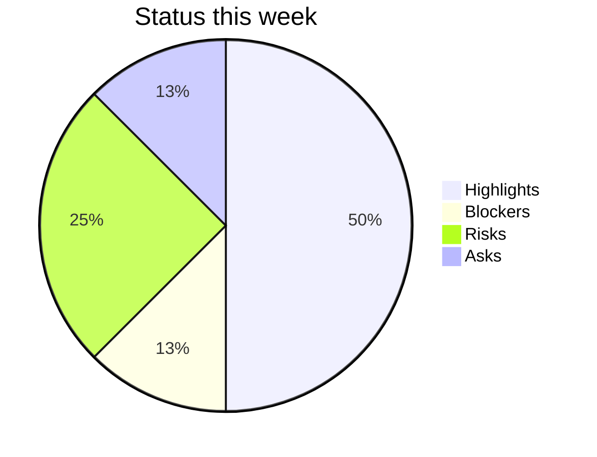

# Status Update Generator

## Overview

Weekly status updates eat 30-90 minutes of every PM's Friday afternoon and they almost always say the same thing in subtly different ways. This skill standardizes the artifact: pull tickets from Jira or Linear (or any JSON dump), and emit a structured update with five named sections -- Highlights, Blockers, Risks, Asks, What's Next -- plus a traffic-light status (Red / Yellow / Green) for the period.

The skill ships with `status_generator.py`, a standard-library Python tool that ingests a JSON file representing a week of ticket state (or accepts the output of a Jira/Linear export) and renders the update in all six formats from the shared PM output schema (`markdown`, `confluence`, `notion`, `linear`, `json`, `mermaid`). Use `--demo` to see the format.

The structure follows two well-known patterns: **SBNR** (Status / Blockers / Next / Risks) -- the operational shorthand many engineering orgs use -- and a condensed version of Amazon's **6-pager** for the narrative framing of the Highlights section. The traffic-light status is from classic stoplight reporting -- Green = on track, Yellow = at risk with a known mitigation, Red = needs intervention now.

### When to Use

- **Weekly exec status update** -- the standard Friday/Monday cadence brief sent to a sponsor, VP, or steering committee.
- **Monthly board / leadership packet** -- aggregate four weekly updates into a monthly view.
- **Sprint review summary** -- end-of-sprint communication that travels outside the team.
- **Cross-team async standup** -- distributed teams where a written async update replaces a sync meeting.
- **Project kickoff status baseline** -- the first status update establishes the template and traffic-light baseline.

### When NOT to Use

- For real-time incident response (use `delivery-manager/` incident skills).
- For deep retrospectives (use `sprint-retrospective/`).
- For one-to-one stakeholder reporting where the audience needs custom framing (use `roadmap-communication/` for that).

## The status update structure

Every update produced by this skill has the same six sections, in this order. Consistency is the point -- exec readers should be able to scan to the section they care about in under 5 seconds.

### Section 1: Header

- **Period**: the date range covered (e.g., "Week of 2026-05-18")
- **Project / team**: the name of the team or initiative
- **Author**: the PM or engineering lead
- **Status (R / Y / G)**: the single overall traffic-light verdict
- **Status rationale**: one sentence explaining why this color

### Section 2: Highlights

Three to five bullet points describing the most important things that shipped, decided, or moved this week. Highlights are **outcome-led**: name what changed for the user or the business, not the activity.

**Bad:** "Shipped PR-1234"
**Good:** "Search latency dropped from 480ms p95 to 210ms p95 after the index rebuild (PR-1234)"

Each highlight should pass the **"so what?" test**: a busy exec who reads only this bullet should understand why it matters.

### Section 3: Blockers

Things currently stopping the team. Each blocker has three parts:

- **What is blocked**: the work item or workstream
- **Who/what is blocking**: the team, vendor, decision, or dependency
- **What we need**: a specific ask or decision

A blocker without a specific ask is a complaint, not a blocker. Promote it to Risks or strike it.

### Section 4: Risks

Things that could become blockers if we do not act. Each risk follows the format:

`<Risk> -- Likelihood (H/M/L) x Impact (H/M/L) -- Mitigation: <action> -- Owner: <name> -- Due: <date>`

This is the format used by `senior-pm/risk_matrix_analyzer.py` so risks can be lifted directly into the portfolio risk register.

### Section 5: Asks

Specific decisions, approvals, resources, or introductions needed from the audience. Each ask names:

- **What you want**
- **By when**
- **From whom**
- **Consequence of delay**

An update without an "Asks" section trains readers that updates require no action. Always include the section, even if the answer is "none this week."

### Section 6: What's Next

The 3-5 most important things planned for the coming week. Same outcome-led style as Highlights. This is the closing read -- it sets expectations for next week's update.

## Traffic-light status (R / Y / G)

| Color | Definition | Rule |
|-------|------------|------|
| **Green** | On track. No active blockers; risks are manageable; commitments will be met. | Use sparingly. Two consecutive Green updates with no new highlights is suspicious. |
| **Yellow** | At risk. There is an issue, but the team has a credible mitigation in flight. | The Risks section must name the mitigation, the owner, and the deadline. |
| **Red** | Off track. Intervention from leadership is required. | A Red update requires an explicit Ask. Red without an Ask means the PM has not done their job. |

### Anti-patterns

- **Watermelon status** -- Green outside, Red inside. The most common failure. Surface the bad news in the rationale sentence.
- **Always-Yellow** -- if every update is Yellow, the team has not made the decision to commit (Green) or to escalate (Red).
- **Color creep** -- the bar for Red should not move week to week. Document the criteria in the team wiki.

## SBNR shorthand

Some teams use SBNR (Status / Blockers / Next / Risks) as a compressed version for daily or async standup. SBNR maps to this skill's sections as follows:

| SBNR field | Section in this skill |
|------------|----------------------|
| **S**tatus | Section 1 (Header) + Section 2 (Highlights) |
| **B**lockers | Section 3 (Blockers) |
| **N**ext | Section 6 (What's Next) |
| **R**isks | Section 4 (Risks) |

The Asks section is unique to the weekly executive variant -- daily SBNR typically does not include explicit asks.

## Workflow

1. **Export ticket data.** Pull from Jira (via JQL or the Atlassian MCP), Linear (via GraphQL or the Linear MCP), or any source that can emit JSON matching the input schema (see Tool Reference).
2. **Augment with narrative.** The PM adds 1-2 sentences of context to each highlight that goes beyond what the ticket title says.
3. **Run `status_generator.py`.** Use `--input status_data.json --format markdown` to render the update. Use `--format confluence` or `--format notion` to push directly to a wiki.
4. **Set the traffic-light status.** This is a human judgment, not a calculation. Document the rationale.
5. **Distribute.** Send via the agreed channel. Always include the Asks section, even if "none this week."
6. **Archive.** Save dated copies. The weekly archive becomes the monthly packet and the quarterly retrospective input.

## Tools

| Tool | Purpose | Command |
|------|---------|---------|
| `status_generator.py` | Generate a structured weekly status update | `python scripts/status_generator.py --input data.json --format markdown` |
| `status_generator.py --demo` | Inspect demo input and output formats | `python scripts/status_generator.py --demo --format markdown` |

## Troubleshooting

| Symptom | Likely Cause | Resolution |
|---------|--------------|------------|
| Exec readers say "I do not know what changed this week" | Highlights are activity-led ("Shipped PR-1234"), not outcome-led | Rewrite each highlight to name the user or business outcome; quantify wherever possible |
| Same blockers appear week after week with no resolution | Blockers documented but no escalation; PM is hoping leadership notices | Promote chronic blockers to Asks with a specific decision request and a deadline |
| Every update is Yellow status | Team has not decided to commit (Green) or to escalate (Red); risk aversion in the PM | Force a decision: name the action that moves to Green OR the intervention needed to address Red |
| Update is 4+ pages long | Highlights and What's Next are too verbose; sections lack a cap | Limit to 5 bullets per section; cap at 1 page or 500 words |
| No one acts on Asks | Asks are vague or missing a consequence-of-delay | Each Ask must name the decision-maker, the deadline, and what happens if not delivered |
| Traffic-light reads "Green" but downstream sees crisis | Watermelon status -- bad news buried in the body | Surface the bad news in the status-rationale sentence; if it changes the color, change the color |
| Tool output does not match Confluence rendering | `--format confluence` requires storage format; some macros do not render in older Confluence | Test in a draft page first; fall back to `--format markdown` for older instances |

## Success Criteria

- The full update fits on one screen (or one page printed)
- Every Highlight passes the "so what?" test -- the outcome is named, not the activity
- The traffic-light color matches the rationale sentence and the body
- The Asks section is present every week (even if "None this week")
- Each Risk has a named owner and a date
- The update is sent on a predictable cadence (same day, same time, every week)
- Stakeholders can answer "what changed and what do you need" without asking follow-up questions

## Scope & Limitations

**In Scope:**
- Generating weekly executive status updates from structured input
- Five-section template (Highlights / Blockers / Risks / Asks / What's Next) with R/Y/G traffic light
- Output in all six SHARED_OUTPUT_SCHEMA formats (json, markdown, mermaid, confluence, notion, linear)
- Aggregating ticket data from Jira-shaped or Linear-shaped JSON dumps
- SBNR shorthand mapping for async standup variants

**Out of Scope:**
- Pulling data directly from Jira or Linear APIs (use the Atlassian MCP, Linear MCP, or `linear-expert/`/`jira-expert/` skills to export the JSON first)
- Sprint analytics or velocity calculation (use `../scrum-master/`)
- Incident communication or postmortems (use `delivery-manager/`)
- Long-form retrospective output (use `sprint-retrospective/`)
- Tailoring updates to multiple audiences in different framings (use `roadmap-communication/`)

**Important Caveats:**
- The traffic-light status is a human judgment. The tool will not infer it from ticket counts. Forcing automation here produces watermelon updates.
- Quantitative claims in Highlights ("latency down to 210ms") must come from real telemetry, not from the ticket title. The tool will not verify these.
- Status updates are most effective on a predictable cadence. A high-quality irregular update is worse than a mediocre regular one.

## Integration Points

| Integration | Direction | Description |
|-------------|-----------|-------------|
| `../jira-expert/` | Receives from | Jira JQL exports or MCP pulls feed the input JSON |
| `linear-expert/` | Receives from | Linear GraphQL exports feed the input JSON |
| `../senior-pm/` | Feeds into | Weekly updates aggregate into monthly portfolio reports; risks lift into the portfolio risk register |
| `../scrum-master/` | Pairs with | Sprint health scores supply the Highlights/Risks context |
| `roadmap-communication/` | Pairs with | Weekly status feeds the executive-variant roadmap narrative |
| `sprint-retrospective/` | Feeds into | Four weeks of status archives become retrospective input |
| `../program-manager/` | Feeds into | Cross-team status aggregation rolls up multiple team updates |
| `../delivery-manager/` | Pairs with | Release windows and incident references show up in Highlights and Risks |

## Tool Reference

### status_generator.py

Generates a structured weekly status update from JSON input. Supports all six SHARED_OUTPUT_SCHEMA formats.

| Flag | Type | Default | Description |
|------|------|---------|-------------|
| `--input` | string | (required unless `--demo`) | Path to JSON file with status data |
| `--demo` | flag | false | Use the built-in demo data |
| `--format` | choice | markdown | Output format: json, markdown, mermaid, confluence, notion, linear |
| `--output` | string | stdout | Output file path |
| `--period` | string | (from input) | Override the period label (e.g., "Week of 2026-05-18") |
| `--status` | choice | (from input) | Override the traffic light: green, yellow, red |

### Input JSON shape

```json
{
  "period": "Week of 2026-05-18",
  "project": "Acme Search Platform",
  "author": "PM Name",
  "status": "yellow",
  "status_rationale": "Index rebuild succeeded; awaiting security review for Phase 2 rollout.",
  "highlights": [
    {
      "title": "Search latency p95 down to 210ms",
      "detail": "Index rebuild dropped p95 from 480ms to 210ms. Customer reports of slow search resolved.",
      "ticket": "PROJ-1234"
    }
  ],
  "blockers": [
    {
      "what": "Phase 2 rollout to enterprise tenants",
      "blocked_by": "Security review (InfoSec team)",
      "need": "Schedule the threat-model review before Friday so rollout can begin next sprint."
    }
  ],
  "risks": [
    {
      "risk": "Cost overrun on infra during traffic ramp",
      "likelihood": "M",
      "impact": "M",
      "mitigation": "Add auto-scale ceiling; alert at 80% budget",
      "owner": "SRE lead",
      "due": "2026-05-30"
    }
  ],
  "asks": [
    {
      "what": "Approval to onboard 3 pilot enterprise tenants",
      "by_when": "2026-05-24",
      "from_whom": "VP Sales",
      "consequence": "Slips the Q2 enterprise revenue target by ~$80K"
    }
  ],
  "next": [
    {
      "title": "Complete security review and start Phase 2 rollout",
      "detail": "Begin with the 3 pilot tenants pending VP Sales sign-off."
    }
  ]
}
```

### Mermaid output

`--format mermaid` produces a stoplight summary chart:



This is useful as a "summary widget" embedded in a longer Confluence/Notion page.

## References

- `references/status-update-style-guide.md` -- Voice, structure, and 5 worked examples (Green / Yellow / Red across different team types)
- `assets/weekly_status_template.md` -- Fill-in template that matches the tool's input JSON structure
