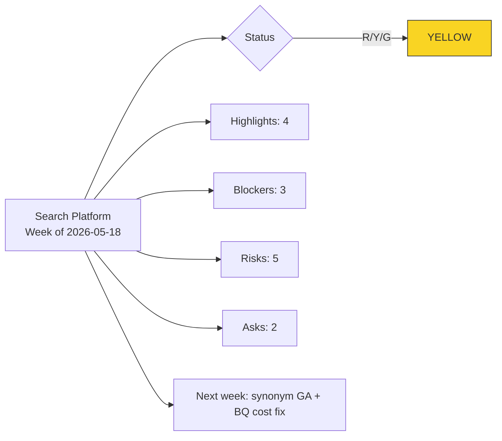

# Example: Weekly Executive Status Update for Acme Analytics Search Platform

> Real-world scenario showing how to apply this skill end-to-end.

## Context

Acme Analytics is a B2B analytics SaaS, Series B, 80 people. The Search Platform team (8 engineers + 1 designer + 1 PM) owns the cross-product search experience. The PM (Priya) writes a weekly status update every Friday for the VP Product and VP Engineering. This week's update is for the period 2026-05-18 to 2026-05-22.

The week was complicated. Search latency improved meaningfully (a real win) but the team also hit two material blockers: the BigQuery cost spike escalation and an index rebuild that revealed a data-quality issue in upstream telemetry. Priya needs to signal Yellow honestly, name asks crisply, and not bury the lead.

## Inputs

- 14 Jira tickets touched this week (5 done, 6 in progress, 3 blocked)
- One incident on Tuesday (SEV-3, contained in 22 minutes)
- Two named asks for leadership
- Five named risks tracked in the team risk register
- Format target: markdown for Slack + Confluence

## Applying the skill

1. **Run `status_generator.py`** on the week's exported ticket data with `--format markdown`.
2. **Edit the highlights** to be outcome-led, not activity-led. "Shipped PR-4521" becomes "Search p95 latency dropped from 480ms to 210ms."
3. **Set traffic light Yellow** with a written one-line rationale: cost spike and data-quality finding both require leadership awareness, neither blocks the week's commitments.
4. **Promote two items to "Asks."** Each ask has a named owner and a date.
5. **Push to Confluence** via `--format confluence` for the weekly archive; copy/paste into the Slack #status-search channel.

## The artifact

### Command

```bash
python scripts/status_generator.py \
  --input search_platform_week_2026-05-22.json \
  --format markdown \
  --period "Week of 2026-05-18" \
  --team "Search Platform" \
  --author "Priya Iyer" \
  --status Yellow \
  --rationale "BigQuery cost spike escalation and upstream telemetry data quality issue both require leadership awareness; neither blocks committed work."
```

### Output

---

# Search Platform -- Weekly Status

**Period:** Week of 2026-05-18 to 2026-05-22
**Team:** Search Platform (8 eng + 1 design + 1 PM)
**Author:** Priya Iyer
**Status:** YELLOW
**Status rationale:** BigQuery cost spike escalation and upstream telemetry data quality issue both require leadership awareness; neither blocks committed work.

## Highlights

- **Search p95 latency dropped 56%** -- from 480ms to 210ms after index rebuild and query plan rewrite went live Wednesday morning. Customer-facing improvement is visible in product analytics; we expect downstream engagement lift in the next 2 weeks. (PR-4521, PR-4525)
- **Multi-tenant index isolation shipped** -- prevents the cross-tenant query-cache leakage that caused SEV-2 incident on May 4. Closes the root-cause action item from the May 6 post-mortem. (WF-3098)
- **Synonym expansion v1 in beta** with 6 design-partner customers. Initial CTR data: search-result CTR up 14% on broad queries. Full rollout in week of May 25 if CTR holds. (PR-4533)
- **Hired a senior backend engineer** -- starts June 8. Picks up the Snowflake connector v2 work that has been blocked on capacity.

## Blockers

| What is blocked | Who/what is blocking | What we need |
|-----------------|---------------------|--------------|
| Snowflake connector v2 | No capacity until new hire onboards Jun 8 | Hold; reassess Jun 15 |
| Search analytics dashboard for CSMs | Data team backlog (we are item #4) | Conversation between VP Product and Head of Data on relative priority |
| Admin SSO bug for Northwind (escalated) | Infra team rolling Auth0 migration | ETA from Infra by EOD Monday May 25 |

## Risks

- **Upstream telemetry data quality issue surfaced during index rebuild.** ~3% of search events have null user_id. Likelihood: H, Impact: M. Mitigation: telemetry team owns root cause; we add server-side fill from session. Owner: Tomas Veliz (telemetry team). Due: 2026-05-29.
- **BigQuery cost spike on search analytics queries.** Daily cost rose 4x after index rebuild because rebuilt index changed query shape. Likelihood: certainty, Impact: M. Mitigation: query optimizer pass + materialized intermediate view. Owner: Sarah Khoury. Due: 2026-05-27.
- **Synonym expansion may regress long-tail search relevance** if rolled out before precision metrics return for narrow queries. L: M, I: M. Mitigation: hold rollout until narrow-query precision >=95% baseline. Owner: Priya. Due: gate before 2026-05-29.
- **New backend engineer ramp on Snowflake connector** could slip Q3 commitment if ramp takes longer than 4 weeks. L: M, I: M. Mitigation: pair on day 1; pre-write design doc this week. Owner: Tomas (tech lead). Due: 2026-06-08.
- **Index rebuild process is manual** (3 hours of senior engineer time). L: H, I: L. Mitigation: automate in week of Jun 1. Owner: Sarah. Due: 2026-06-05.

## Asks

1. **VP Product / VP Engineering**: please align with Head of Data on whether the search analytics dashboard moves up from #4 to #2 in their queue. Currently blocking CSM team for at least 2 weeks. **Decision needed by Tuesday May 26.** Owner: Priya to schedule the conversation.
2. **VP Engineering**: budget approval for $4,500/month BigQuery materialized view storage (offset by query cost savings of ~$12K/month). **Decision needed by Friday May 29** to land before quarter-end. Owner: Sarah Khoury.

## What's next

- **Week of May 25:** Roll out synonym expansion to remaining customer cohort if narrow-query precision holds. Land BigQuery cost optimization. Onboard backend engineer (offer accepted; start date June 8).
- **Week of June 1:** Search relevance v2 design doc circulated. Automate index rebuild process. Begin Snowflake connector v2 design with new hire.
- **End of June checkpoint:** Synonym expansion full rollout; index rebuild fully automated; BQ cost back to baseline; Snowflake connector v2 in implementation.

---

### Companion output: Mermaid status snapshot

The same data rendered as a 1-glance status snapshot for the leadership dashboard:



### Companion output: ticket roll-up

| Status | Count | Tickets |
|--------|-------|---------|
| Done this week | 5 | PR-4521, PR-4525, WF-3098, PR-4533, PR-4541 |
| In progress | 6 | PR-4540, PR-4548, PR-4555, PR-4560, PR-4565, PR-4572 |
| Blocked | 3 | SF-001 (cap), DASH-014 (data team), SSO-008 (infra) |

## Why this works

- Yellow has a *written one-line rationale*. The exec who skims the header knows why before reading on.
- Highlights pass the "so what" test: each leads with the outcome (latency dropped 56%), not the activity (shipped PR-4521). PR number is in parens, not in the headline.
- Blockers each have a specific ask. The Snowflake item that has no ask gets explicitly flagged as "Hold; reassess Jun 15" -- it is honest about being a watch item, not a fake blocker.
- Asks have a named owner, a named decider, and a date. They are decisions that can happen, not vague pleas.
- Risks use the senior-pm risk register format (L/I + mitigation + owner + due) so they lift directly into the portfolio register without reformatting.
- The status is genuinely Yellow. The team had a great week on the work and still has real issues to surface. Not artificial Red, not pretend Green.

## What's next

- Push to Confluence via `--format confluence` for the weekly archive.
- Aggregate four weekly updates into a monthly board view using `../quarterly-planning/`.
- Use `../../sprint-retrospective/` for the end-of-sprint internal retro that informs next week's status.
- If risks materialize, escalate via `../../senior-pm/` portfolio risk register.
- Reuse the team configuration in the next weekly run; only the data file changes.
