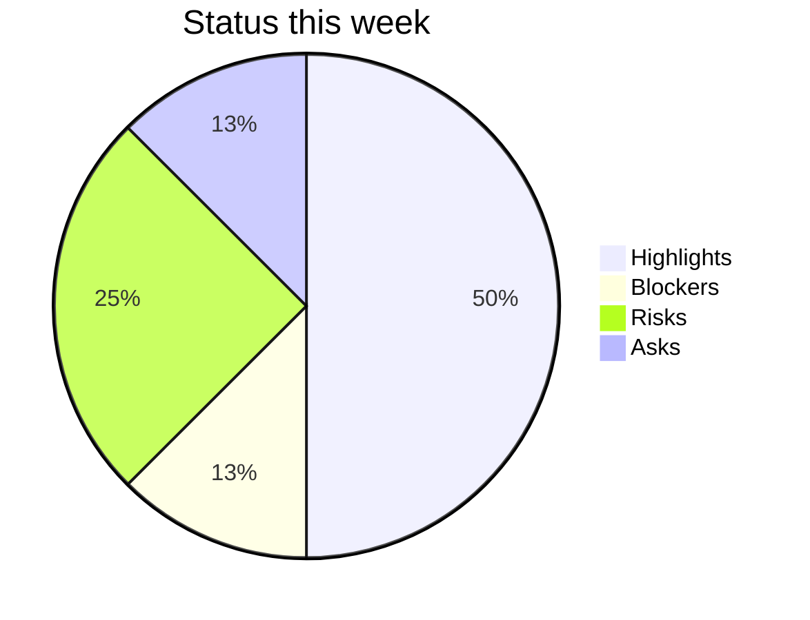

# Tool Reference, Troubleshooting & Success Criteria

Read this when running `status_generator.py` (flags, input JSON shape, Mermaid output), diagnosing a status-update problem, or checking whether an update meets its quality bar.

## Troubleshooting

| Symptom | Likely Cause | Resolution |
|---------|--------------|------------|
| Exec readers say "I do not know what changed this week" | Highlights are activity-led ("Shipped PR-1234"), not outcome-led | Rewrite each highlight to name the user or business outcome; quantify wherever possible |
| Same blockers appear week after week with no resolution | Blockers documented but no escalation; PM is hoping leadership notices | Promote chronic blockers to Asks with a specific decision request and a deadline |
| Every update is Yellow status | Team has not decided to commit (Green) or to escalate (Red); risk aversion in the PM | Force a decision: name the action that moves to Green OR the intervention needed to address Red |
| Update is 4+ pages long | Highlights and What's Next are too verbose; sections lack a cap | Limit to 5 bullets per section; cap at 1 page or 500 words |
| No one acts on Asks | Asks are vague or missing a consequence-of-delay | Each Ask must name the decision-maker, the deadline, and what happens if not delivered |
| Traffic-light reads "Green" but downstream sees crisis | Watermelon status -- bad news buried in the body | Surface the bad news in the status-rationale sentence; if it changes the color, change the color |
| Tool output does not match Confluence rendering | `--format confluence` requires storage format; some macros do not render in older Confluence | Test in a draft page first; fall back to `--format markdown` for older instances |

## Success Criteria

- The full update fits on one screen (or one page printed)
- Every Highlight passes the "so what?" test -- the outcome is named, not the activity
- The traffic-light color matches the rationale sentence and the body
- The Asks section is present every week (even if "None this week")
- Each Risk has a named owner and a date
- The update is sent on a predictable cadence (same day, same time, every week)
- Stakeholders can answer "what changed and what do you need" without asking follow-up questions

## Tool Reference

### status_generator.py

Generates a structured weekly status update from JSON input. Supports all six SHARED_OUTPUT_SCHEMA formats.

| Flag | Type | Default | Description |
|------|------|---------|-------------|
| `--input` | string | (required unless `--demo`) | Path to JSON file with status data |
| `--demo` | flag | false | Use the built-in demo data |
| `--format` | choice | markdown | Output format: json, markdown, mermaid, confluence, notion, linear |
| `--output` | string | stdout | Output file path |
| `--period` | string | (from input) | Override the period label (e.g., "Week of 2026-05-18") |
| `--status` | choice | (from input) | Override the traffic light: green, yellow, red |

### Input JSON shape

```json
{
  "period": "Week of 2026-05-18",
  "project": "Acme Search Platform",
  "author": "PM Name",
  "status": "yellow",
  "status_rationale": "Index rebuild succeeded; awaiting security review for Phase 2 rollout.",
  "highlights": [
    {
      "title": "Search latency p95 down to 210ms",
      "detail": "Index rebuild dropped p95 from 480ms to 210ms. Customer reports of slow search resolved.",
      "ticket": "PROJ-1234"
    }
  ],
  "blockers": [
    {
      "what": "Phase 2 rollout to enterprise tenants",
      "blocked_by": "Security review (InfoSec team)",
      "need": "Schedule the threat-model review before Friday so rollout can begin next sprint."
    }
  ],
  "risks": [
    {
      "risk": "Cost overrun on infra during traffic ramp",
      "likelihood": "M",
      "impact": "M",
      "mitigation": "Add auto-scale ceiling; alert at 80% budget",
      "owner": "SRE lead",
      "due": "2026-05-30"
    }
  ],
  "asks": [
    {
      "what": "Approval to onboard 3 pilot enterprise tenants",
      "by_when": "2026-05-24",
      "from_whom": "VP Sales",
      "consequence": "Slips the Q2 enterprise revenue target by ~$80K"
    }
  ],
  "next": [
    {
      "title": "Complete security review and start Phase 2 rollout",
      "detail": "Begin with the 3 pilot tenants pending VP Sales sign-off."
    }
  ]
}
```

### Mermaid output

`--format mermaid` produces a stoplight summary chart:



This is useful as a "summary widget" embedded in a longer Confluence/Notion page.
