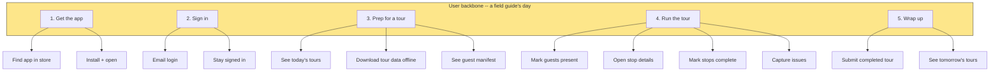

# Example: Story Map for Wayfinder Mobile App Onboarding

> Real-world scenario showing how to apply this skill end-to-end.

## Context

Wayfinder (travel-tech, Series B) is launching a mobile app for tour operators' field guides. The app's most-critical journey is onboarding -- a new field guide downloads, signs in, downloads tour data offline, and runs a tour without WiFi. The PM (Liana) is using a Jeff Patton-style user story map to scope MVP, v1.1, and v1.2 releases for the design partner cohort.

Without a story map, the team has been arguing about whether biometric login is "MVP" since week one. The map will end the argument by visualizing the full user backbone, mapping all candidate stories underneath, then drawing release lines that say: this slice gets to the moment of value.

## Inputs

- Single user persona: "Field guide" -- a tour operator's contractor who runs day tours on a mobile device
- Constraint: must work offline for a full 8-hour tour
- Three releases planned: MVP (Aug 2026), v1.1 (Oct 2026), v1.2 (Dec 2026)
- Design partner cohort: 12 tour operators
- Goal: by v1.2, 80% of field guides at design-partner operators run all tours from the mobile app

## Applying the skill

1. **Define the backbone (user activities, left to right).** What does a field guide do, in order? Five activities: get the app, sign in, prep for a tour, run the tour, wrap up.
2. **Decompose each activity into user tasks.** Each task is a verb-noun the user does ("download offline data," "check guest list").
3. **Map candidate stories under each task.** Stories are the concrete implementation slices.
4. **Draw the first release line (MVP)** above the minimum stories that get the user from "get the app" to "run the tour" once.
5. **Draw v1.1 and v1.2** above subsequent layers of richness.
6. **Confirm by walking the map** -- can the user actually complete a tour with only the MVP stories? If not, raise the line.

## The artifact

### Story map (Mermaid)



### Stories under each task (full grid)

| User task | MVP (Aug 2026) | v1.1 (Oct 2026) | v1.2 (Dec 2026) |
|-----------|----------------|-----------------|-----------------|
| Find app in store | App listed in iOS + Android stores with screenshots | App store optimization (better description, video) | -- |
| Install + open | Standard install + cold-start splash | Skeleton screens during data load | Update available banner |
| Email login | Magic link via email | Password + email | Biometric login (Face ID / fingerprint) |
| Stay signed in | 30-day refresh token | -- | SSO via tour operator's IdP |
| See today's tours | List of today's tours (online fetch + cache) | Pull-to-refresh + last-sync timestamp | Tomorrow + day-after preview |
| Download tour data offline | Manual "Download" button per tour; downloads guest list + stop notes + map tiles | Background pre-download night before | Smart partial sync (only changes) |
| See guest manifest | List of guests with party size + special requests | Search + filter manifest | Photo of guest (where consented) |
| Mark guests present | Tap to mark present; offline-safe | "All present" bulk action | Photo capture of group at start |
| Open stop details | Stop notes, photos, map pin | Audio guide playback | AR overlays at named landmarks |
| Mark stops complete | Tap to mark complete | Auto-detect on geofence enter/exit | Multi-stop bulk complete |
| Capture issues | Free-text issue note offline; queued for sync | Photo attachment to issue | Categorized issue types + severity |
| Submit completed tour | Auto-sync on WiFi return | Manual submit button + sync status | Pre-flight validation before submit |
| See tomorrow's tours | -- | List view | Calendar view with conflict warnings |

### Release-line walkthrough

**MVP (Aug 2026):** "Can a field guide download an app, sign in via magic link, download tour data offline, run an 8-hour tour with no signal, then auto-sync when WiFi comes back?"

Walking the MVP row left to right:
- Find app in store -> install -> magic-link login -> see today's tours -> download tour offline -> see manifest -> mark guests present -> open stop details -> mark stops complete -> capture issue offline -> tour ends -> walk back to WiFi -> tour auto-syncs -> done.

Yes. MVP completes the journey once.

**v1.1 (Oct 2026):** Adds the things field guides told us would save them 5+ minutes per tour:
- Background pre-download (do not need to remember the night before)
- Audio guide playback (stops feel richer)
- Geofence auto-complete (one less tap per stop)
- Manifest search (find a guest fast when group is 30 people)

**v1.2 (Dec 2026):** Adds the things tour operators told us would unlock training and quality:
- Biometric login (a tour-day usability win)
- SSO (tour operator IT can manage)
- AR overlays at landmarks (the demo-able differentiator)
- Tomorrow + day-after preview (lets the guide prep better)

### What is explicitly out of scope (no release line)

- In-app booking / payment (this is for guides, not guests)
- Multi-language UI beyond English/Spanish (Q1 2027)
- Tablet-specific layout (iPad will work in scale mode -- not a redesign)
- Apple Watch companion (someone always asks; the answer is no, not now)

### Validation cohorts per release

| Release | Cohort | Validation focus |
|---------|--------|------------------|
| MVP | 3 design-partner operators, ~30 field guides | Can they complete a tour offline? |
| v1.1 | 8 design-partner operators, ~80 field guides | Does pre-download + auto-complete remove the friction? |
| v1.2 | All 12 design partners, ~160 field guides | Are >=80% of tours run from mobile? |

### Sketch -- the story map on the whiteboard

```
                    1. GET APP    2. SIGN IN     3. PREP        4. RUN TOUR        5. WRAP UP
                    -----------   -----------    ------------   ----------------   --------------
BACKBONE            find/install  email login    see tours      mark guests        submit tour
                                  stay-signed    download tour  open stops         see tomorrow
                                                 guest manifest mark complete
                                                                capture issues

----- MVP line -----
MVP STORIES         app in store  magic link     list tours     present (tap)      auto-sync on
                    install       30-day token   download btn   stop details       WiFi
                                                 manifest list  mark complete
                                                                free-text issue

----- v1.1 line -----
v1.1 STORIES        skeleton      password+      pull-refresh   bulk all-present   manual submit
                    screens       email          background     audio guide        tomorrow list
                                                 pre-download   geofence auto
                                                 sync stamp     manifest search
                                                                photo attach

----- v1.2 line -----
v1.2 STORIES        update        biometric +    smart partial  photo capture      pre-flight
                    banner        SSO            sync           AR overlays        validation
                                                 day-after view bulk complete      calendar
                                                 guest photos   categorized issues
```

## Why this works

- The backbone (5 user activities) is genuinely the journey, not a feature taxonomy. Reading it left-to-right tells a story.
- The MVP release line is drawn after the team walked the map together. The walk caught two missing stories ("issue capture" was below the line in the first draft, but field guides need to log issues offline -- it had to come up).
- Biometric login was the big argument going in. The map puts it in v1.2 with a defensible reason -- magic link unblocks MVP, biometric adds polish later -- and the argument stopped.
- Out-of-scope items are written down. "Apple Watch companion: no, not now" is a sentence the team can point to.
- Each release has a validation cohort. The map is not a launch plan -- it is a learning plan.

## What's next

- Convert each MVP story to a backlog item via `../story-splitting/` (some stories are too big).
- Write the PRD for the MVP slice using `../create-prd/`.
- Convert stories to WWAS / Why-What-Acceptance format via `../wwas/`.
- Plan the design-partner rollout via `../beta-program/`.
- Track release readiness via `../status-update-generator/`.
